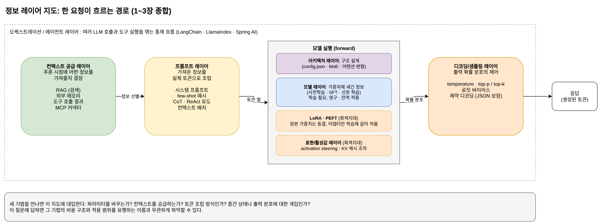

[[ch-gray-zone]]
= 회색지대와 컨텍스트 공급 레이어

== 두 레이어 사이

모델 레이어와 프롬프트 레이어의 구분은 대부분의 기법을 깔끔하게 정리해 주지만, 전부는 아니다. 파라미터를 건드리되 원본은 보존하는 기법, 토큰도 가중치도 아닌 중간 계산 상태에 개입하는 기법이 있다. 이 장에서는 그 회색지대를 살펴보고, 분류를 더 정밀하게 만드는 추가 차원을 도입한 뒤, RAG의 위치를 정한다.

== PEFT: 파라미터의 일부만 학습

PEFT(Parameter-Efficient Fine-Tuning)는 전체 파라미터를 다시 학습하는 대신 작은 부분만 학습하는 기법군이다.

대표는 LoRA(Low-Rank Adaptation)다. 미세조정으로 생기는 가중치 변화량 ΔW를 통째로 학습하는 대신, 두 개의 작은 행렬 B와 A의 곱으로 근사한다. 원래 가중치 W는 동결하고 B와 A만 학습하며, 추론 시에는 W + BA를 쓴다. 행렬의 랭크를 낮게 잡으면 학습 대상 파라미터가 전체의 1% 아래로 줄어들어, 소비자용 GPU에서도 큰 모델을 조정할 수 있다. QLoRA는 여기에 원본 가중치의 4비트 양자화를 더해 메모리를 더 아낀다.

LoRA가 회색지대인 이유는 배포 특성 때문이다. 파라미터를 바꾼다는 면에서는 모델 레이어지만, 원본 모델은 그대로 두고 수십 MB 수준의 어댑터 파일만 주고받는다. 하나의 베이스 모델에 어댑터를 바꿔 끼우며 여러 용도로 쓸 수 있어서, "요청마다 갈아 끼울 수 있는 정보"라는 프롬프트 레이어의 성질을 일부 갖는다. adapters, prefix tuning, prompt tuning(학습된 가상 토큰을 프롬프트 앞에 붙이는 방식)도 같은 계열이다. 이 기법군의 표준 구현은 Hugging Face의 `peft` 라이브러리이고, LoRA 어댑터의 저장과 로딩 형식도 이 라이브러리의 규약을 따르는 경우가 많다.

== 추론 중 개입

=== KV 캐시 조작

트랜스포머는 추론 중에 각 토큰의 어텐션 키(key)와 밸류(value)를 캐시에 쌓아 두고 재사용한다(이 구조는 2부의 microGPT 구현에서 직접 보게 된다). 이미 계산된 컨텍스트의 KV 캐시를 저장했다가 재사용하면 같은 문서를 매번 다시 처리하지 않아도 되고, 한 걸음 더 나가면 캐시를 주입하거나 조작해서 모델의 상태에 개입할 수도 있다. 토큰을 넣는 것도 가중치를 바꾸는 것도 아닌, 중간 계산 상태에 대한 개입이다.

=== Activation steering

모델이 추론하는 동안 특정 레이어의 활성값 벡터에 방향 벡터를 더하거나 빼서 출력 성향을 조절하는 기법이다. 예를 들어 "정직함" 방향의 벡터를 찾아 활성값에 더하면 답변의 성향이 그쪽으로 이동한다. 가중치는 그대로지만 프롬프트로 지시한 것도 아니라는 면에서, 두 레이어 사이의 통로를 쓰는 기법이다.

=== 디코딩 제어

모델의 forward 계산이 끝나면 다음 토큰에 대한 확률 분포가 나온다. 디코딩 제어는 이 분포를 출력 직전에 조작한다.

* *temperature*: 분포의 뾰족함을 조절한다. 낮으면 확률 높은 토큰에 집중해 일관된 출력이, 높으면 다양한 출력이 나온다.
* *top-p / top-k*: 확률 상위 일부 토큰만 후보로 남긴다.
* *로짓 바이어스*: 특정 토큰의 확률을 인위적으로 올리거나 내린다. 특정 단어를 금지하는 데 쓸 수 있다.
* *제약 디코딩(constrained decoding)*: JSON 스키마나 문법에 맞는 토큰만 허용해서 형식을 보장한다. 2장의 구조화된 출력 지시를 프롬프트 수준의 부탁에서 구조적 보장으로 격상시키는 수단이다. Outlines, XGrammar 같은 오픈소스 구현이 있고, vLLM을 비롯한 서빙 엔진에 내장되어 있다.

디코딩 제어는 애플리케이션 코드에서 가장 자주 만지는 부분이다. Spring AI에서는 `ChatOptions`(Ollama용 구현은 `OllamaOptions`)로 요청 단위의 디코딩 파라미터를 지정한다.

[source,java]
----
include::../examples/spring-ai/src/main/java/com/example/springai/DecodingExample.java[tag=chat-options,indent=0]
----

같은 프롬프트라도 temperature 0에서는 매번 거의 같은 답이, 1.2에서는 요청마다 다른 답이 나온다. 모델의 가중치도 입력 토큰도 같지만 확률 분포에서 뽑는 방식이 달라지기 때문이다. temperature가 분포를 실제로 어떻게 바꾸는지는 2부의 microGPT 샘플링 코드에서 수식 그대로 확인한다.

== 분류를 더 정밀하게: 추가 차원

모델/프롬프트 두 레이어 구분에 다음 차원들을 추가하면 회색지대의 기법들이 제자리를 찾는다.

아키텍처 레이어::
정보 처리 구조 자체의 설계. 전문가 네트워크를 여럿 두고 토큰마다 일부만 활성화하는 MoE(Mixture of Experts), 검색 모듈을 모델 구조에 통합한 REALM과 RETRO, 메모리 전용 토큰 슬롯 같은 설계가 여기에 속한다. 학습 전에 결정되며, 3부에서 다룰 `config.json`이 이 레이어의 기술서다.

표현/활성값 레이어::
forward pass 중간 상태에 대한 개입. activation steering과 KV 캐시 조작이 여기에 해당한다.

디코딩/샘플링 레이어::
출력 확률 분포의 제어. temperature, top-p, 로짓 바이어스, 제약 디코딩.

오케스트레이션/에이전트 레이어::
여러 LLM 호출을 엮는 통제 흐름. 어떤 호출의 출력이 다음 호출의 입력이 되는지, 언제 도구를 실행하는지를 단일 호출 바깥에서 설계한다. 정보가 모델 안으로 들어가는 방식이 아니라 모델 호출들 사이를 흐르는 방식을 결정한다. LangChain, LlamaIndex, 그리고 이 책의 예제가 쓰는 Spring AI가 이 레이어를 담당하는 프레임워크다.

도구 사용은 이 분류에서도 양면적이다. 도구의 결과가 컨텍스트로 들어오는 방향은 프롬프트 레이어의 일이지만, 도구가 외부 세계의 상태를 바꾸는 방향(메일 발송, DB 수정)은 정보 전달이라는 틀 바깥의 일이다. 에이전트 시스템을 설계할 때는 이 두 방향을 구분해서 다뤄야 한다.

== RAG의 위치와 컨텍스트 공급 레이어

RAG는 개념적으로 프롬프트 레이어의 하위 범주다. 검색된 문서가 결국 토큰으로 컨텍스트에 들어가기 때문이다. 하지만 실무에서는 독립된 서브시스템으로 다루는 편이 낫다. 이유는 두 가지다.

첫째, 검색 시스템의 설계가 그 자체로 복잡하다. 임베딩 모델, 벡터 DB, 청킹 전략, 재순위 모델을 각각 선정하고 튜닝해야 하며, 각 구성요소의 품질이 최종 답변 품질을 좌우한다. 둘째, 이 최적화는 베이스 LLM과 무관하게 독립적으로 진행할 수 있다. 생성 모델을 교체해도 검색 파이프라인은 대부분 그대로 쓴다.

그래서 메모리 시스템, MCP, 도구 사용과 RAG를 묶어 "컨텍스트 공급 레이어"라는 중간 분류를 두면 실무 구조와 잘 맞는다. 최종 분류는 다음과 같다.

1. *모델 레이어*: 파라미터에 정보를 새긴다. 학습이 필요하고 영구적이다.
2. *컨텍스트 공급 레이어*: 추론 시점에 어떤 정보를 가져올지 결정한다. RAG, 메모리, 도구, MCP.
3. *프롬프트 레이어*: 가져온 정보를 실제 토큰으로 조립한다. 시스템 프롬프트, 예시, 컨텍스트 배치.

.정보 레이어 지도: 한 요청이 흐르는 경로

새로운 기법을 만났을 때 이 분류에 대입해 보면 본질이 빨리 보인다. "파라미터를 바꾸는가? 컨텍스트를 공급하는가? 토큰 조립 방식인가? 아니면 중간 상태나 출력 분포에 대한 개입인가?" 이 질문에 답하면 그 기법의 비용 구조와 적용 범위를 유행하는 이름과 무관하게 파악할 수 있다.

== 실무 선택: 파인튜닝인가 RAG인가

이 분류의 쓸모를 가장 자주 시험하는 질문이 "우리 데이터를 파인튜닝으로 넣을까, RAG로 넣을까"다. 1부에서 확인한 레이어의 특성이 그대로 판단 기준이 된다.

정보가 얼마나 자주 바뀌는가::
매일 갱신되는 재고, 사용자별 데이터는 재학습으로 따라갈 수 없다. 컨텍스트 공급이 답이다. 몇 년 단위로 안정된 도메인 지식이라면 모델 레이어도 후보가 된다.

출처를 제시해야 하는가::
가중치에 새긴 지식은 분산 표현이라 어느 답변이 어디에 근거했는지 특정할 수 없다. "이 답변은 이 문서에 근거했다"가 요구사항이라면 문서를 검색해 컨텍스트에 넣는 쪽만 가능하다.

가르치려는 것이 지식인가, 행동인가::
1장의 SFT에서 본 구분이 그대로 적용된다. 용어 사용법, 답변 형식, 거절 기준 같은 행동 양식은 파인튜닝이 잘 새기고, 프롬프트로는 지시가 길어질수록 일관성이 떨어진다. 반대로 사실 지식을 파인튜닝으로 넣는 것은 효율이 낮고, 학습 데이터에 없던 질문에서 그럴듯한 오답을 만들기 쉽다.

사용자마다 볼 수 있는 정보가 다른가::
가중치에 들어간 정보는 모든 요청에 전역으로 적용되므로 사용자별로 켜고 끌 수 없다. 접근 권한 제어가 필요한 정보는 요청 시점에 권한으로 걸러 넣는 컨텍스트 공급만 가능하다.

네 기준이 가리키는 답이 서로 다르면 조합하면 된다. 흔한 구성은 행동과 문체는 파인튜닝(또는 기성 instruct 모델)에 맡기고 사실 정보는 RAG로 공급하는 것이다. "파인튜닝 대 RAG"는 양자택일 논쟁으로 자주 소비되지만, 두 기법은 서로 다른 레이어에 속하므로 애초에 경쟁 관계가 아니다.

지금까지 정보가 모델로 들어가는 경로를 분류했다. 다음 부에서는 이 모든 분류의 바탕인 모델 자체의 동작 원리를, 실행되는 코드로 확인한다.
