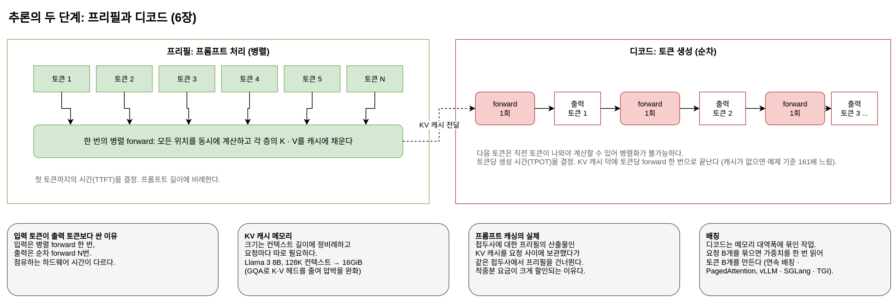

[[ch-inference-serving]]
= 추론 서빙의 원리: 토큰은 왜 그 가격인가

앞의 두 장에서 GPT가 학습하고 추론하는 원리를 코드로 확인했다. 그런데 상용 API의 가격표를 열어 보면 원리만으로는 설명되지 않아 보이는 사실들이 있다. 입력 토큰은 출력 토큰보다 몇 배 싸고, 캐시가 적중한 입력은 거기서 다시 큰 폭으로 할인된다. 첫 글자가 나올 때까지는 한참 기다리는데 그다음부터는 술술 흘러나온다. 이 장은 이런 현상들이 전부 트랜스포머 추론의 구조에서 기계적으로 유도된다는 것을 보인다.

이번에도 실행되는 코드로 확인한다. ``examples/go/serving``은 microGPT와 같은 구조를 학습 없이 float64로만 다시 쓴 작은 트랜스포머(4층, 임베딩 64차원)로, 무작위 가중치를 쓴다. 시간과 메모리를 재는 것이 목적이고 계산량은 가중치 값과 무관하므로, 학습을 생략해도 측정에는 지장이 없다.

== 추론의 두 단계: 프리필과 디코드

LLM이 요청 하나를 처리하는 과정은 성격이 다른 두 단계로 나뉜다.

프리필(prefill):: 프롬프트 전체를 처리해 각 층의 K, V를 캐시에 채우는 단계다. 프롬프트 토큰은 전부 미리 알고 있으므로, 모든 위치의 계산을 동시에 진행할 수 있다.
디코드(decode):: 토큰을 하나씩 생성하는 단계다. 다음 토큰을 계산하려면 직전 토큰이 먼저 나와야 하므로, 생성 토큰 수만큼의 순차 반복을 피할 수 없다.

같은 forward 계산인데 병렬성이 다르다. 이 차이를 코드로 확인한다.

[source,go]
----
include::../examples/go/serving/main.go[tag=prefill,indent=0]
----

여기서 ``parallelFor``는 작업을 CPU 코어들에 나눠 실행하는 함수다. GPU가 수천 개의 연산 유닛으로 하는 일을 CPU 코어 몇 개로 축소해서 흉내 낸 것이다. 256토큰 프롬프트로 실행한 결과다(8코어 기계 기준이며, 수치는 실행 환경에 따라 다르다).

----
== 프리필: 프롬프트 처리 ==
한 토큰씩 순차 처리:   125.6ms
위치들을 병렬 처리:     32.7ms (3.8배)
두 방식의 마지막 은닉 벡터 일치: true
----

계산량은 같은데 벽시계 시간이 코어 수에 가깝게 줄었다. GPU에서는 이 배율이 수백 배 이상으로 커진다. 실제 GPU 구현에서는 어텐션 계산의 메모리 접근 순서를 최적화한 FlashAttention 같은 오픈소스 커널이 더해지며, 주요 추론 엔진들이 이를 내장하고 있다. 반면 디코드는 병렬화할 위치 자체가 없다. 아무리 큰 GPU라도 토큰 하나를 만들려면 forward 한 번을 통째로 기다려야 한다.

이 비대칭이 가격표와 지연의 모양을 결정한다.

* *입력 토큰이 출력 토큰보다 싼 이유*: 입력 1,000토큰은 병렬로 한 번에 처리되지만, 출력 1,000토큰은 forward 1,000번의 순차 실행이다. 서비스 제공자 입장에서 점유하는 하드웨어 시간이 다르므로 가격도 다르다.
* *지연의 두 지표*: 첫 토큰까지의 시간(TTFT, time to first token)은 프리필이 결정하므로 프롬프트 길이에 비례한다. 그 뒤 토큰당 생성 시간(TPOT, time per output token)은 디코드가 결정한다. 스트리밍 응답에서 첫 글자만 늦게 나오는 이유, 그리고 응답 속도를 줄이고 싶으면 프롬프트가 아니라 출력 길이부터 줄여야 하는 이유가 여기 있다.

.프리필과 디코드의 비대칭, 그리고 거기서 유도되는 사실들

== KV 캐시: 같은 계산을 두 번 하지 않기

디코드가 토큰당 forward 한 번으로 끝나는 것은 당연하지 않다. 5장에서 본 것처럼 어텐션은 현재 토큰의 Q를 앞선 모든 토큰의 K, V와 대조하는 연산이다. 캐시가 없다면 새 토큰을 만들 때마다 앞 토큰 전체의 K, V를 처음부터 다시 계산해야 한다. microGPT의 ``Forward``가 위치마다 K, V를 캐시에 쌓아 두던 것이 바로 이 재계산을 피하는 장치였고, 프로덕션 추론 엔진의 KV 캐시도 같은 원리다.

캐시가 없으면 무슨 일이 생기는지 직접 재 본다.

[source,go]
----
include::../examples/go/serving/main.go[tag=nocache,indent=0]
----

256토큰 프롬프트 뒤에 64토큰을 생성한 결과다.

----
== 디코드: 토큰 생성 ==
KV 캐시 사용:    61.9ms (토큰당 970µs)
캐시 없음:      9.9446s (토큰당 155.38ms, 161배)
두 방식의 생성 결과 일치: true
----

생성 결과는 완전히 같은데 시간이 161배 차이 난다. 캐시 없는 생성은 토큰 하나마다 시퀀스 전체를 다시 계산하므로, 시퀀스가 길어질수록 토큰당 비용이 계속 늘어난다. KV 캐시는 이 재계산을 "저장해 둔 K, V를 읽는 것"으로 바꾼다. 계산을 메모리로 산 것이다.

그 메모리가 얼마나 필요한지도 공식 하나로 계산된다.

[source,go]
----
include::../examples/go/serving/main.go[tag=memory,indent=0]
----

----
== KV 캐시 크기 ==
이 예제 모델 (4층, 헤드 8개, 컨텍스트 512, float64): 2.0 MiB
Llama 3 8B (32층, KV 헤드 8개, 헤드 차원 128, FP16):
  컨텍스트    8192 토큰: 1.0 GiB
  컨텍스트  131072 토큰: 16.0 GiB
GQA 없이 KV 헤드 32개라면, 컨텍스트 131072 토큰: 64.0 GiB
----

주목할 것은 캐시 크기가 컨텍스트 길이에 정비례한다는 사실이다. 8B급 모델이 128K 컨텍스트를 가득 채우면 캐시만 16GiB로, 4비트로 양자화한 모델 가중치(약 4GiB)의 네 배다. 게다가 이 캐시는 가중치와 달리 요청마다 따로 필요하다. 긴 컨텍스트가 비싼 이유는 어텐션 계산량 증가 이전에, 요청 하나가 점유하는 GPU 메모리가 이만큼 커지기 때문이다.

마지막 줄의 GQA(grouped-query attention)는 이 압박에 대한 아키텍처 차원의 대응이다. Q 헤드는 32개를 유지하되 여러 Q 헤드가 K, V 헤드를 나눠 쓰게 하면(위 설정에서는 4개당 1개) 캐시가 그 비율만큼 줄어든다. K, V 헤드를 1개까지 줄인 극단이 MQA(multi-query attention)다. 최근 모델 대부분이 GQA를 쓰는 이유는 표현력 때문이 아니라 서빙 메모리 때문이고, 이 선택은 3부에서 볼 ``config.json``의 `num_key_value_heads` 필드에 기록된다.

== 프롬프트 캐싱의 실체

2장에서 프롬프트 캐싱을 "여러 요청이 공유하는 접두사의 내부 계산 결과를 재사용하는 것"이라고 소개했다. 이제 그 내부 계산 결과가 무엇인지 말할 수 있다. 접두사에 대한 프리필의 산출물, 즉 KV 캐시다. 요청이 끝난 뒤에도 캐시를 버리지 않고 보관했다가, 같은 접두사로 시작하는 다음 요청에서 프리필을 건너뛰는 것이다.

적중 조건이 "토큰이 완전히 같은 접두사"인 이유도 어텐션 구조에서 유도된다. causal 어텐션에서 위치 i의 K, V는 위치 0부터 i까지의 토큰에만 의존한다. 그래서 앞부분이 같으면 그 구간의 K, V도 같고, 재사용할 수 있다. 반대로 토큰 하나라도 달라지면 그 위치부터 뒤쪽의 K, V는 전부 무효가 된다. 프롬프트 중간에 현재 시각이나 요청 ID를 끼워 넣으면 그 뒤의 캐시가 전부 빠지는 이유, 그리고 변하지 않는 지침을 앞에 두고 가변 데이터를 뒤에 두라는 2장의 배치 규칙이 원리에서 그대로 나온다.

과금 구조도 이 실체와 맞아떨어진다. 캐시 적중분의 요금을 정가의 10분의 1 수준으로 낮추는 API가 흔한데, 프리필 계산이 통째로 생략되고 메모리 보관과 읽기 비용만 남기 때문이다. 반대로 캐시 저장에 웃돈을 받거나 보관 시간을 제한하는 것은, 방금 계산했듯 KV 캐시가 GiB 단위의 GPU 메모리를 점유하기 때문이다.

== 배칭: GPU를 놀리지 않는 법

디코드에는 또 하나의 비효율이 숨어 있다. 토큰 하나를 생성하는 forward는 모델의 모든 가중치를 메모리에서 읽지만, 각 가중치로 하는 계산은 벡터 곱 한 번뿐이다. GPU의 연산 능력 기준으로 보면 디코드는 계산이 아니라 가중치를 읽어 오는 메모리 대역폭에 묶인 작업이고, 연산 유닛 대부분은 놀고 있다.

해법은 요청을 묶는 것이다. 요청 B개의 디코드를 한 번에 진행하면, 가중치를 한 번 읽어서 토큰 B개를 만든다. 메모리 읽기 비용은 그대로인데 산출이 B배가 되므로, GPU 처리량은 동시 요청 수에 따라 몇 배에서 수십 배까지 늘어난다. 개별 요청의 지연은 거의 그대로다.

프로덕션 서빙 엔진은 여기서 두 가지를 더한다. 연속 배칭(continuous batching)은 배치를 요청 단위가 아니라 토큰 단위로 관리해서, 끝난 요청의 자리를 기다리는 요청이 즉시 채우게 한다. 응답 길이가 제각각인 LLM 워크로드에서 배치 자리가 비는 시간을 없애는 기법이다. PagedAttention은 요청마다 컨텍스트 최대 길이만큼 연속 메모리를 예약하는 대신, KV 캐시를 운영체제의 가상 메모리처럼 고정 크기 블록으로 나눠 필요한 만큼만 할당한다. 같은 GPU 메모리에 더 많은 요청의 캐시가 들어가므로 배치가 커지고 처리량이 늘어난다. 이 두 기법을 구현한 대표 엔진이 vLLM이고, SGLang과 Hugging Face의 TGI 같은 다른 오픈소스 서빙 엔진들도 같은 기법 위에 각자의 최적화를 더한다.

배칭의 경제학은 셀프 호스팅 판단의 근거이기도 하다. GPU의 토큰당 비용은 배치가 가득 찼을 때의 이야기다. 동시 요청이 몇 개 안 되는 서비스가 GPU를 통째로 빌리면 하드웨어 시간 대부분을 유휴로 지불하게 되어, 수많은 고객의 요청으로 배치를 채우는 상용 API보다 토큰당 비용이 오히려 비싸진다. 셀프 호스팅이 유리해지는 것은 배치를 채울 만큼 트래픽이 있거나, 데이터를 외부로 보낼 수 없는 제약이 있을 때다.

== 추론 가속: 투기적 디코딩

디코드의 순차성 자체를 우회하는 기법도 있다. 투기적 디코딩(speculative decoding)은 작은 초안 모델이 다음 토큰 여러 개를 먼저 생성하고, 큰 모델이 그 후보 열을 프리필처럼 한 번의 병렬 forward로 검증한다. 큰 모델의 분포와 일치하는 앞부분까지는 채택하고, 어긋나는 첫 토큰부터는 버리고 다시 시작한다.

핵심은 이 기법이 출력 분포를 바꾸지 않는다는 것이다. 채택과 기각의 규칙이 "큰 모델이 혼자 생성했을 때와 같은 확률 분포"를 보장하도록 설계되어 있어서, 품질 저하 없이 순수하게 속도만 얻는다. 계산량은 오히려 늘지만(초안 모델 실행과 기각된 후보의 낭비), "큰 모델의 순차 forward 횟수"가 줄어들어 벽시계 시간이 준다. 프리필은 병렬이 되는데 디코드는 안 된다는 이 장의 비대칭을, 디코드 일부를 프리필 모양으로 바꿔서 공략하는 것이다. 예측하기 쉬운 토큰(정형화된 코드, 상용구)이 많을수록 채택률이 올라가 이득이 커진다.

== 서빙 스택 지도와 응용 개발자의 체크리스트

이 장의 원리들을 기준으로 놓으면 추론 스택의 선택지가 정리된다.

[cols="1,2,2"]
|===
| 스택 | 최적화 대상 | 어울리는 자리

| llama.cpp, Ollama
| 양자화로 메모리를 줄여 GPU 없이도 실행 (7장의 GGUF 포맷)
| 개인 기기, 로컬 개발, 동시 요청이 적은 환경

| vLLM, SGLang 등 서빙 엔진
| 연속 배칭과 PagedAttention으로 처리량 극대화
| 트래픽이 배치를 채우는 셀프 호스팅 서비스

| 상용 API
| 대규모 배칭과 프롬프트 캐싱을 관리형으로 제공
| 트래픽이 불규칙하거나 운영 부담을 피하고 싶은 경우
|===

비용이나 지연이 문제일 때의 점검 순서도 원리에서 나온다.

1. *프롬프트 접두사를 캐시에 맞게 정리한다*. 변하지 않는 지침과 문서를 앞에, 가변 데이터를 뒤에 둔다. 프리필 비용이 할인 요금으로 바뀐다.
2. *출력 길이를 줄인다*. 출력 토큰은 순차 디코드이므로 지연과 비용 모두에서 입력 토큰보다 비싸다. 필요한 형식만 짧게 내게 하는 지시가 모델 교체보다 먼저다.
3. *컨텍스트 길이를 예산으로 관리한다*. 긴 컨텍스트는 과금뿐 아니라 TTFT와 KV 캐시 메모리를 함께 키운다. 넣을 수 있다고 다 넣지 않는다.
4. *그다음에 모델과 양자화를 조정한다*. 여기서부터는 품질과의 교환이므로, 위의 공짜 개선들을 소진한 뒤에 손댄다.

여기까지가 2부다. 우리는 다음 토큰 예측이라는 문제 정의에서 출발해 학습과 추론을 코드로 확인했고, 그 추론이 프로덕션 규모에서 갖는 비용 구조까지 측정했다. 이제 이렇게 학습되고 서빙되는 모델이 파일로 저장되어 세계에 유통되는 방식, 그리고 그 유통을 떠받치는 표준들을 3부에서 살펴본다.
