[[ch-math-stats]]
= 코드 뒤의 수학과 통계

== 이 장을 읽는 방법

2부의 앞 세 장은 수식 대신 실행되는 코드로 원리를 설명했다. 그런데 그 코드 뒤에는 몇 가지 수학·통계 개념이 있고, 이 개념들의 감각이 있으면 코드가 왜 그렇게 생겼는지가 더 분명해진다. 손실이 왜 ``-log(확률)``인지, 어텐션 점수를 왜 ``sqrt(headDim)``으로 나누는지, temperature가 분포의 모양을 왜 그렇게 바꾸는지가 모두 수학 한두 줄로 설명된다. 이 장은 그 개념들을 한곳에 모아 정리한다. 증명은 없고, 각 개념이 이 책의 어느 장과 이어지는지를 함께 적었다.

다루는 개념 대부분은 고등학교 수학(벡터, 미분, 지수와 로그, 확률과 통계)의 연장이라서, 그 연결도 절마다 함께 짚는다. 로그는 모두 자연로그(`ln`)를 쓴다.

설명 순서는 5장 학습 루프의 순서를 따른다. 모델이 다루는 벡터와 행렬(forward), 모델이 내놓는 확률 분포(출력), 그 분포를 채점하는 손실(로그와 정보량), 손실을 줄이는 방향을 알아내는 미분(역전파와 옵티마이저)까지가 앞의 네 절이다. 그 뒤의 다섯 절은 학습 루프 바깥에서 쓰이는 통계 개념을 다룬다. 값의 규모를 관리하는 평균과 분산, 데이터의 구조를 찾는 상관·주성분·군집, 신경망의 원형인 회귀, 토큰 생성을 확률 과정으로 보는 마르코프 체인과 강화학습, 마지막으로 규모와 측정의 통계(스케일링 법칙, 검색 점수, 유의성 검정)다. 뒤쪽 절들은 3부와 4부의 내용을 미리 언급하므로, 해당 장을 읽은 뒤에 돌아와 읽어도 된다.

[cols="2,4,3"]
|===
| 절 | 개념 | 이어지는 장

| 벡터와 행렬
| 내적, 코사인 유사도, 행렬 곱, 랭크와 저랭크 근사
| 3장 LoRA, 5장 임베딩과 어텐션, 6장 추론 비용, 11장 벡터 검색

| 확률
| 확률 분포, 조건부 확률, 베이즈 정리, softmax, temperature, 샘플링
| 3장 디코딩 제어, 4장과 5장의 다음 토큰 예측, 11장 BM25

| 로그와 정보량
| 최대 우도, 교차 엔트로피, 엔트로피, perplexity, KL 발산
| 1장 증류와 RLHF, 5장 학습 루프

| 미분
| 도함수, 그래디언트, 체인 룰, 경사 하강법, Adam
| 4장 자동 미분, 5장 옵티마이저

| 평균과 분산
| 분산, 정규화, 정규 분포, 중심 극한 정리
| 5장 RMSNorm과 스케일링, 8장 NF4 양자화

| 데이터의 구조
| 공분산, 상관계수, 주성분 분석, 판별 분석, k-평균 군집화
| 3장 activation steering, 8장 양자화, 11장 벡터 인덱스

| 회귀
| 선형 회귀, 로지스틱 회귀, 다중공선성
| 1장 선호 학습과 분산 표현, 5장 lmHead, 8장 GPTQ

| 확률 과정과 결정
| 마르코프 체인, 벨만 방정식
| 도입 장, 1장 RLHF와 RLVR, 6장 KV 캐시

| 규모와 측정
| 멱법칙, TF-IDF, BM25, 표준 오차, t-검정, 분산 분석
| 1장 규모의 감각, 11장 키워드 검색, 13장 평가셋
|===

== 벡터와 행렬: 모델이 다루는 표현

=== 벡터와 내적

**벡터**는 숫자를 나열한 배열이다. ``[0.2, -1.3, 0.7]``처럼 코드에서는 float 배열 하나일 뿐이지만, 기하학적으로는 고차원 공간의 좌표로 볼 수 있다. 5장의 임베딩이 정확히 이것이다. 토큰 하나를 수백 차원 공간의 한 좌표로 나타내고, 의미가 비슷한 토큰이 가까운 좌표에 놓이도록 학습한다. 11장의 벡터 검색도 같은 관점 위에 있다. 텍스트를 좌표로 바꿔 두고 질의와 가까운 문서를 찾는다.

*내적*(dot product)은 두 벡터의 같은 위치 성분끼리 곱해서 모두 더한 값이다.

----
a = [1, 2], b = [3, 4]
a·b = 1*3 + 2*4 = 11
----

고등학교 기하에서 배운 내적과 같은 연산이며, 차원이 2, 3에서 수백으로 늘었을 뿐 계산 규칙은 같다. 고등학교에서는 내적의 다른 정의도 배웠다. 내적은 두 벡터의 길이와 사잇각 θ의 코사인을 곱한 값, 즉 ``a·b = |a| * |b| * cos θ``이기도 하다. 두 정의가 같은 값을 내므로, 성분끼리 곱해 더하는 계산만으로 두 벡터의 사잇각을 알 수 있다. 내적은 두 벡터의 방향이 비슷할수록 커지고, 수직이면 0, 반대 방향이면 음수가 된다. 그래서 내적은 "얼마나 비슷한가"를 재는 가장 기본적인 도구가 된다. 5장의 어텐션 점수가 쿼리 벡터와 키 벡터의 내적이다. 쿼리와 방향이 비슷한 키일수록 높은 점수를 받는다.

.벡터와 내적. 내적의 부호와 크기는 두 벡터의 사잇각이 정한다
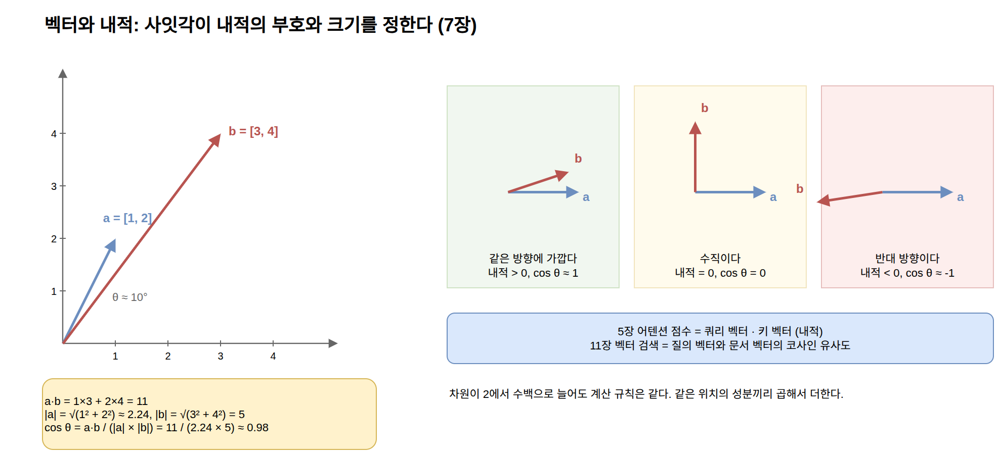

=== 코사인 유사도

**코사인 유사도**는 내적을 두 벡터의 길이로 나눈 값, 곧 사잇각의 코사인이다.

----
|a| = sqrt(1² + 2²) ≈ 2.236,  |b| = sqrt(3² + 4²) = 5

cos(a, b) = a·b / (|a| * |b|)
          = 11 / (2.236 * 5) ≈ 0.98
----

여기서 ``|a|``는 벡터의 길이(각 성분 제곱합의 제곱근)로, 피타고라스 정리를 d차원으로 늘린 것이다. 위 예의 두 벡터는 사잇각이 약 10도라서 코사인이 1에 가깝다. 길이로 나누면 벡터의 크기는 무시되고 방향만 비교되므로, 값이 항상 -1에서 1 사이에 들어온다. 긴 문서든 짧은 질의든 같은 잣대로 비교할 수 있어서, 11장의 벡터 검색이 유사도 계산에 이것을 쓴다. 벡터의 길이를 미리 1로 맞춰 두면(정규화) 코사인 유사도는 내적과 같아진다. 많은 임베딩 모델이 길이 1인 벡터를 내놓는 이유이며, 그런 벡터에는 Vector DB가 내적만 계산해도 코사인 유사도가 나온다.

=== 행렬: 벡터를 다른 벡터로 바꾸는 변환

**행렬**은 벡터를 다른 벡터로 바꾸는 변환이다. 행렬 곱 한 번은 "입력 벡터의 각 성분을 서로 다른 가중치로 섞어서 새 벡터를 만드는" 연산이다. 2×2 행렬로 확인하면 다음과 같다.

----
W = [[2, 0],      x = [1, 2]
     [1, 1]]

Wx = [2*1 + 0*2,   = [2,
      1*1 + 1*2]      3]
----

출력의 각 성분은 입력 성분들의 가중합이고, 행렬의 각 행이 그 가중치다. 즉 행렬 곱은 "행렬의 각 행과 입력 벡터의 내적"을 행마다 반복한 것이다. 입력이 d차원이고 출력이 m차원이면 행렬은 m×d 크기이고 곱셈은 m*d번 필요하다. 신경망의 한 층은 이 행렬 곱에 비선형 함수를 붙인 것이다. 5장에서 임베딩 차원의 벡터를 어휘 크기의 로짓으로 바꾸던 `lmHead` 투영이 행렬 곱 하나이고, 어텐션의 쿼리·키·밸류를 만드는 것도 각각 행렬 곱이다.

비선형 함수가 꼭 필요한 이유도 이 계산 규칙에서 나온다. 행렬 곱 두 개를 이어 붙인 ``W2(W1 x)``는 두 행렬을 먼저 곱한 하나의 행렬 ``(W2 W1)``을 x에 곱한 것과 같다.

----
W1 = [[2, 0],   W2 = [[1, 1],   W2 W1 = [[3, 1],
      [1, 1]]         [0, 2]]            [2, 2]]

x = [1, 2]이면  W1 x = [2, 3],  W2 (W1 x) = [5, 6],  (W2 W1) x = [5, 6]
----

그러므로 행렬 곱만 아무리 쌓아도 결과는 행렬 곱 한 번이고, 층을 늘려도 표현력이 늘지 않는다. 층 사이에 직선이 아닌 함수를 끼워야 앞 층의 출력을 구부리거나 잘라 낼 수 있고, 그래야 층을 쌓는 의미가 생긴다. 5장 MLP 블록의 두 행렬 곱 사이에 있던 ``tanh``가 이 자리이고, 프로덕션 모델이 쓰는 GELU나 SwiGLU도 같은 역할이다.

.비선형 함수의 역할. 행렬 곱만 이으면 직선 하나로 합쳐지고, 사이에 tanh를 끼우면 구부러진 곡선이 된다
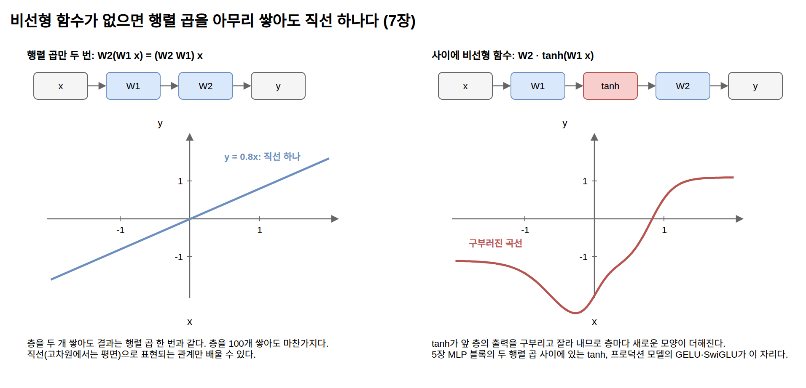

LLM의 파라미터 대부분은 이런 행렬들의 성분이고, 추론의 계산 대부분도 행렬 곱이다. GPU가 LLM에 필수인 이유는 행렬 곱을 대규모로 병렬 처리하는 장치이기 때문이며, 6장의 추론 비용 구조도 결국 "행렬 곱에 필요한 데이터를 메모리에서 얼마나 실어 나르는가"의 문제였다. 디코드 단계에서 토큰 하나를 만들 때마다 모델의 모든 행렬을 한 번씩 읽어야 하는데, 각 행렬로 하는 일은 벡터 하나와의 곱뿐이라 연산보다 읽기가 병목이 된다.

벡터 하나가 아니라 벡터 여러 개를 한꺼번에 변환하면 행렬과 행렬의 곱이 된다. 토큰 T개의 쿼리 벡터를 행으로 쌓은 T×d 행렬 Q와 키 벡터를 쌓은 K를 곱한 ``Q Kᵀ``는 T×T 행렬이고, 그 (i, j) 성분이 i번째 쿼리와 j번째 키의 내적, 곧 어텐션 점수다.

----
프리필: 점수 행렬 = Q Kᵀ / sqrt(d)    (T×d 곱하기 d×T = T×T)
디코드: 점수 벡터 = q Kᵀ / sqrt(d)    (1×d 곱하기 d×T = 1×T)
----

6장의 프리필이 위의 행렬 곱이고, 디코드는 새 토큰의 쿼리 하나만 있으므로 아래의 벡터와 행렬의 곱이다. 계산량은 프리필이 T배 많지만 읽어야 하는 K는 같다. 읽은 데이터 한 번에 프리필은 계산을 T번 하고 디코드는 한 번만 하므로, 같은 데이터를 읽고도 프리필은 연산이, 디코드는 읽기가 병목이 되는 6장의 비대칭이 이 차이에서 나온다.

.프리필의 행렬×행렬과 디코드의 벡터×행렬. 읽는 K는 같은데 곱셈 횟수는 T배 차이가 난다
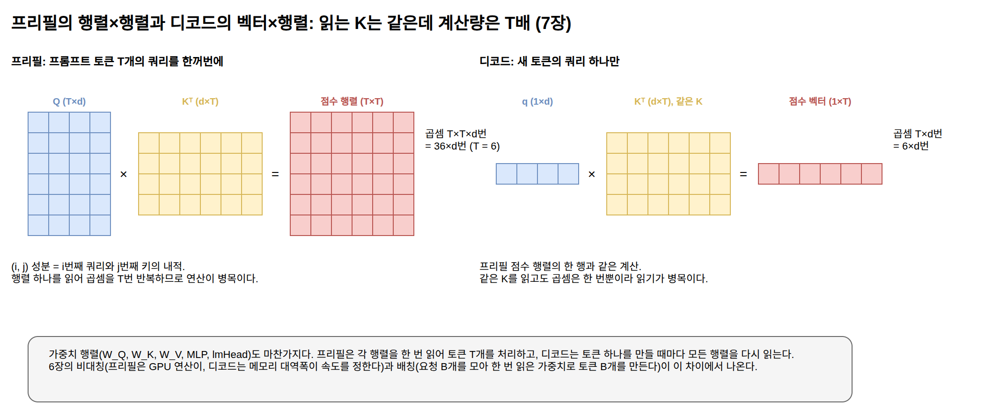

=== 랭크와 저랭크 근사

행렬의 *랭크*(rank)는 그 행렬이 담고 있는 독립적인 방향의 수다. 행렬의 각 행을 벡터로 볼 때, 다른 행들의 가중합으로 만들 수 없는 행이 몇 개인지가 랭크다.

----
W = [[1, 2],     둘째 행이 첫째 행의 2배이므로 랭크 1
     [2, 4]]

W = [1] × [1, 2]   (2×1 행렬과 1×2 행렬의 곱으로 정확히 복원된다)
    [2]
----

이 2×2 행렬은 저장할 숫자가 4개에서 4개로 같아 이득이 없지만, 크기가 커지면 달라진다. d×d 행렬이라도 랭크가 r이면 d×r 행렬과 r×d 행렬의 곱으로 정확히 표현할 수 있다. 저장할 숫자가 d²개에서 2dr개로 줄어들므로, r이 d보다 훨씬 작으면 큰 압축이 된다. d가 4,096이고 r이 8이면 숫자가 약 1,677만 개에서 6만 5천 개로, 원래의 0.4%가 된다. 랭크가 정확히 낮지 않은 행렬도 "거의 낮은" 경우에는 이런 곱으로 근사할 수 있는데, 이것이 *저랭크 근사*(low-rank approximation)다.

.저랭크 근사. d×d 행렬을 d×r과 r×d 두 행렬의 곱으로 대신하면 저장할 숫자가 d²개에서 2dr개로 줄어든다
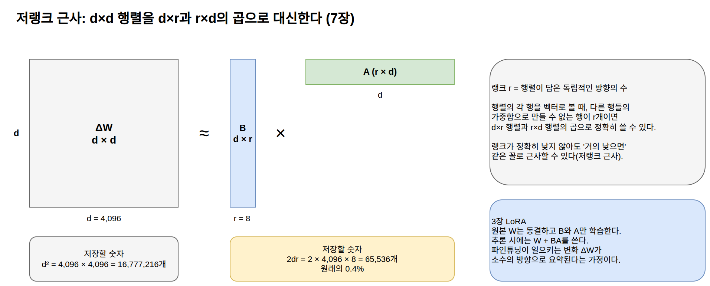

이 관점이 본문과 만나는 자리는 3장의 LoRA다. LoRA는 파인튜닝으로 생기는 가중치 변화량 ΔW를 통째로 학습하는 대신 두 작은 행렬의 곱 B×A로 근사하는데, 이것이 정확히 저랭크 근사다. "파인튜닝이 모델에 일으키는 변화는 소수의 방향으로 요약된다"는 가정이 실제로 성립하기 때문에, 학습 파라미터를 전체의 1% 아래로 줄여도 효과가 유지된다. 데이터에서 "소수의 중요한 방향"을 통계적으로 찾아내는 기법인 주성분 분석은 뒤의 데이터의 구조 절에서 다룬다.

== 확률: 모델이 내놓는 출력

=== 확률 분포와 조건부 확률

**확률 분포**는 일어날 수 있는 모든 경우에 확률을 배정한 것으로, 전체 합이 1이다. LLM의 출력이 정확히 이것이다. 매 위치에서 어휘에 있는 모든 토큰에 확률을 배정한, 항목이 어휘 크기만큼 있는 이산 확률 분포가 나온다.

*조건부 확률* ``P(A | B)``는 "B가 주어졌을 때 A일 확률"이다. 언어 모델의 정의가 조건부 확률로 쓰인다.

----
P(다음 토큰 | 지금까지의 토큰들)
----

곱의 법칙에 따라 문장 전체의 확률은 조건부 확률들의 곱으로 분해된다.

----
P(토큰1, 토큰2, 토큰3) = P(토큰1) * P(토큰2 | 토큰1) * P(토큰3 | 토큰1, 토큰2)
----

그래서 "다음 토큰 예측"이라는 하나의 과제만 잘하면 문장 전체에 확률을 매길 수 있고, 5장에서 본 것처럼 토큰을 하나씩 이어 붙이는 것만으로 텍스트가 생성된다.

초기의 통계적 언어 모델(n-gram)은 이 조건부 확률을 말뭉치에서 직접 세어 표로 만들었다. 직전 두세 개 토큰까지만 조건으로 삼을 수 있었고, 표에 없는 조합에는 답할 수 없었다. 신경망 언어 모델은 이 표를 함수로 대체한다. 파라미터가 압축한 패턴으로 확률을 계산하므로, 학습 데이터에 없던 조합에도 그럴듯한 분포를 내놓는다.

=== 베이즈 정리와 나이브 베이즈

**베이즈 정리**는 조건부 확률의 방향을 뒤집는 공식이다.

----
P(A | B) = P(B | A) * P(A) / P(B)
----

"결과를 보고 원인의 확률을 갱신한다"고 읽는다. 관찰하기 쉬운 방향의 확률 P(B|A)를 이용해서 알고 싶은 방향의 확률 P(A|B)를 계산한다. 숫자를 넣어 보면 이렇다. 전체 메일의 20%가 스팸이고, 스팸의 50%에 "무료"라는 단어가 나오며, 정상 메일에서는 5%에만 나온다고 하자. "무료"가 들어 있는 메일이 스팸일 확률은 다음과 같다.

----
P(스팸 | 무료) = P(무료 | 스팸) * P(스팸) / P(무료)
              = 0.5 * 0.2 / (0.5 * 0.2 + 0.05 * 0.8)
              = 0.10 / 0.14 ≈ 0.71
----

분모의 P(무료)는 스팸에서 "무료"가 나올 확률과 정상 메일에서 나올 확률을 합친 것이다. 단어 하나를 관찰했을 뿐인데 스팸일 확률이 20%에서 71%로 갱신되었다. 이 책의 범위에서 이 정리가 실제로 일하는 자리는 검색이다. 11장에서 다룰 BM25의 배경인 확률적 검색 모형은 "이 문서가 질의와 관련 있을 확률"을 베이즈 정리로 추정하는 모형이고, 흔한 단어의 점수를 깎는 IDF의 로그식은 그 유도에서 남은 흔적이다. LLM의 다음 토큰 예측 자체는 베이즈 정리를 명시적으로 쓰지 않지만, 조건부 확률이라는 같은 언어 위에 서 있다.

베이즈 정리를 텍스트 분류에 적용한 고전이 *나이브 베이즈*(naive Bayes)다. "이 텍스트가 스팸일 확률"을 P(단어들|스팸)과 P(스팸)의 곱으로 뒤집어 계산하되, 클래스만 주어지면 단어들이 서로 독립이라고 가정해서(이 과감한 가정이 naive라는 이름의 유래다) P(단어들|클래스)를 단어별 확률의 곱, 실제 계산으로는 로그 확률의 합으로 단순화한다. 위에서 그린 구도에 놓으면 위치가 선명하다. LLM은 앞의 모든 토큰을 조건으로 삼고, n-gram은 직전 두세 개만 남기고, 나이브 베이즈는 순서와 문맥을 전부 버리고 단어의 존재만 센다. 같은 곱의 법칙 위에서 조건을 얼마나 유지하느냐의 차이다. 앞 문단에서 말한 BM25의 배경 모형도 문서의 단어들이 관련성만 주어지면 독립이라고 가정하는, 나이브 베이즈와 같은 독립 가정 위에서 유도된다. LLM 이전 시대에 스팸 필터 같은 텍스트 분류를 도맡았던 것이 이 분류기이고, 12장에서 "쿼리 처리는 작고 빠른 모델"에 맡긴다고 한 역할 분담의 전신이기도 하다.

.조건을 얼마나 유지하는가. LLM은 앞의 모든 토큰을, n-gram은 직전 두 토큰만, 나이브 베이즈는 순서 없는 단어 집합만 조건으로 삼는다
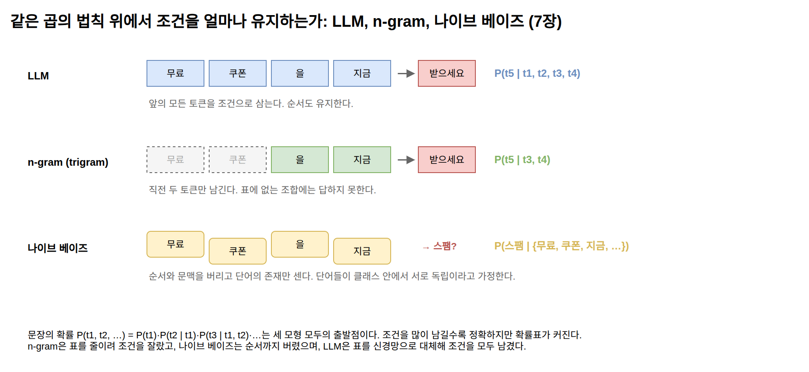

=== 로짓, softmax, temperature

모델의 마지막 행렬 곱이 내놓는 것은 확률이 아니라 *로짓*(logit)이다. 로짓은 제약 없는 실수 점수라서 음수일 수도 있고 합이 1도 아니다. 이것을 확률 분포로 바꾸는 함수가 **softmax**다. 각 점수에 지수 함수를 적용한 뒤 전체 합으로 나눈다.

----
softmax(z)_i = exp(z_i) / Σ_j exp(z_j)

로짓:    [2.0, 1.0, 0.1]
exp:     [7.39, 2.72, 1.11]   (합 11.21)
softmax: [0.66, 0.24, 0.10]   (합 1.0)
----

지수 함수를 쓰는 이유는 두 가지다. 결과가 항상 양수이고, 점수 차이를 배율 차이로 벌려 준다. 두 로짓의 차이가 Δ이면 두 확률의 비는 ``exp(Δ)``이므로, 점수가 1 크면 확률은 약 2.7배가 된다. 4장에서 "숫자를 넣은 계산 예시"라고 미뤄 두었던 것이 이 표다.

softmax는 로짓 전체에서 같은 수를 빼도 결과가 변하지 않는다. 분자와 분모에 똑같이 ``exp(-c)``가 곱해져 약분되기 때문이다.

----
softmax(z - c) = softmax(z)

로짓 [2.0, 1.0, 0.1]에서 최댓값 2.0을 뺀 [0, -1.0, -1.9]도 softmax는 [0.66, 0.24, 0.10]
----

이 성질은 구현에서 쓸모가 있다. ``exp(710)``은 배정밀도 부동소수점의 상한(약 ``1.8 * 10^308``)을 넘어 무한대가 되므로, 로짓이 수백 정도만 되어도 지수 계산이 넘친다(오버플로). 로짓에서 최댓값을 뺀 뒤 지수를 취하면 가장 큰 항이 ``exp(0) = 1``이 되어 넘칠 일이 없고, 결과는 같다. 5장 ``Gpt.softmax``가 지수를 취하기 전에 최댓값을 빼는 이유가 이것이다.

**temperature**는 softmax 직전에 로짓을 나누는 수 T다. 로짓을 T로 나누면 로짓의 차이 Δ가 Δ/T로 바뀌므로, 확률의 비가 ``exp(Δ/T)``가 된다. T가 0.5이면 점수 차이 1이 배율 7.4배로 벌어지고, T가 2이면 1.6배로 좁혀진다. 위와 같은 로짓에 T를 다르게 적용하면 분포의 모양이 달라진다.

----
T = 0.5: [0.86, 0.12, 0.02]  (뾰족해짐: 1위 토큰에 집중)
T = 1.0: [0.66, 0.24, 0.10]  (원래 분포)
T = 2.0: [0.50, 0.30, 0.19]  (평평해짐: 하위 토큰에도 기회)
----

.softmax와 temperature. 같은 로짓이라도 T에 따라 분포의 뾰족함이 달라진다
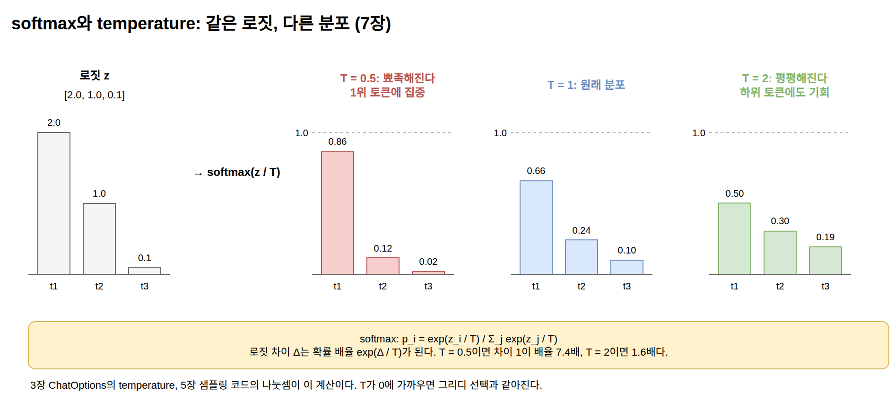

T가 0에 가까우면 가장 점수 높은 토큰만 남고(그리디 선택과 같아진다), T가 크면 균등 분포에 가까워진다. 3장의 ``ChatOptions``에서 지정하던 temperature와 5장의 샘플링 코드에 있던 나눗셈이 이 표의 계산이다.

=== 샘플링과 후보 제한

**샘플링**은 분포에서 실제로 하나를 뽑는 일이다. 확률 0.66인 토큰은 100번 중 66번쯤 뽑히고, 0.10인 토큰도 10번쯤은 뽑힌다. 뽑기이므로 같은 분포에서도 매번 다른 결과가 나올 수 있다. 3장에서 본, 같은 프롬프트에 매번 다른 답이 나오는 현상은 모델이 아니라 이 뽑기 단계의 성질이다.

뽑는 절차는 단순하다. 0과 1 사이의 난수 하나를 뽑고, 확률을 앞에서부터 누적하다가 누적합이 난수를 넘어서는 첫 토큰을 고른다.

----
확률:   [0.66, 0.24, 0.10]
누적합: [0.66, 0.90, 1.00]

난수 0.75 → 둘째 토큰 (0.66 < 0.75 ≤ 0.90)
난수 0.30 → 첫째 토큰 (0.30 ≤ 0.66)
----

누적합에서 각 토큰이 차지하는 구간의 길이가 그 토큰의 확률이므로, 난수가 그 구간에 떨어질 확률이 곧 토큰의 확률이 된다. 5장 ``Main.sampleFrom``이 이 절차이고, temperature와 아래의 top-k, top-p는 모두 난수를 뽑기 전에 확률 배열을 손보는 조작이다.

top-k와 top-p는 이 뽑기의 후보를 제한하는 조작이다. top-k는 확률 상위 k개만, top-p는 확률을 큰 순서로 더해 p에 이르는 토큰들까지만 후보로 남기고, 남은 토큰들의 확률을 합이 1이 되도록 다시 나눈다. 위의 T = 1 분포에 top-k = 2를 적용하면 세 번째 토큰이 제거되고 남은 두 토큰이 ``[0.73, 0.27]``로 재정규화된다. temperature가 분포 전체의 모양을 바꾼다면, 이 둘은 꼬리를 잘라 낸다. 확률이 낮은 토큰 수천 개가 각각은 작아도 합치면 무시할 수 없는 확률을 차지하므로, 그쪽에서 엉뚱한 토큰이 뽑히는 일을 막는 장치다.

.샘플링과 후보 제한. 누적 확률 막대에서 난수가 떨어진 구간의 토큰을 고르고, top-k와 top-p는 뽑기 전에 꼬리를 잘라 낸다
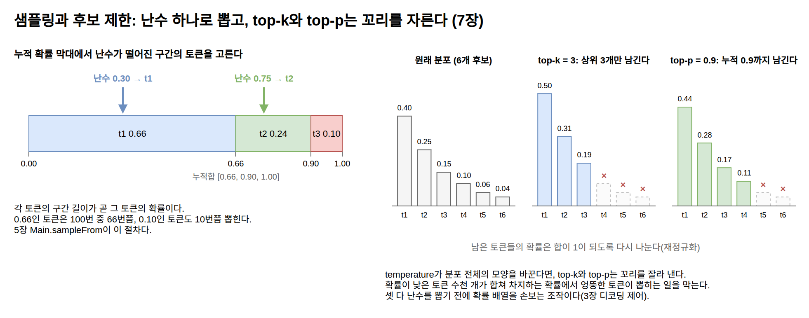

== 로그와 정보량: 모델을 채점하는 손실

=== 로그: 곱을 합으로

**로그**는 곱을 합으로 바꾼다. `log(a*b) = log(a) + log(b)`. 고등학교에서 배운 로그의 성질 그대로다. 문장의 확률은 조건부 확률 수백 개의 곱이라 1보다 훨씬 작은 수들이 계속 곱해진다. 확률 0.1인 토큰이 300개 이어지면 문장의 확률은 ``10^-300``으로, 배정밀도 부동소수점이 정상적으로 표현하는 가장 작은 수(약 ``2.2 * 10^-308``)에 거의 닿는다. 조금만 더 길어지면 0으로 내려앉는다(언더플로). 로그를 취하면 같은 값이 ``300 * ln(0.1) ≈ -690.8``이라는 평범한 크기의 수가 된다. 그래서 확률 계산은 거의 항상 로그 확률의 합으로 수행된다.

이 장에서 쓰는 로그의 성질은 세 가지이고, 뒤의 둘은 첫째에서 나온다.

----
log(a * b) = log(a) + log(b)     곱을 합으로: 문장의 확률, 최대 우도
log(a / b) = log(a) - log(b)     비율을 차로: KL 발산, IDF
log(a^n)   = n * log(a)          거듭제곱을 곱으로: 멱법칙
----

=== 최대 우도와 교차 엔트로피

학습의 목표는 *최대 우도*(maximum likelihood)로 표현된다. 학습 데이터에 모델이 배정하는 확률, 즉 우도를 최대로 만드는 파라미터를 찾는 것이다. 데이터셋 전체의 우도는 앞 절의 곱의 법칙에 따라 각 위치에서 정답 토큰에 배정한 조건부 확률들의 곱이고, 로그를 취하면 로그 확률의 합이 된다. 확률의 최대화는 로그 확률의 최대화와 같고, 부호를 뒤집으면 최소화 문제가 된다. 그 결과가 5장 학습 루프의 **교차 엔트로피 손실**이다.

----
손실 = -log(정답 토큰에 배정된 확률)

확률 0.9  → 손실 0.11
확률 0.5  → 손실 0.69
확률 0.01 → 손실 4.61
----

정답에 확률 1을 주면 손실이 0이고, 정답을 확신 있게 틀릴수록 손실이 가파르게 커진다. 오차의 제곱 같은 다른 손실과 비교하면 이 가파름이 보인다. 정답 확률이 0.01일 때 제곱 오차 ``(1 - 0.01)²``은 0.98에서 멈추지만 ``-log``는 4.61이고, 확률이 0에 가까워질수록 한없이 커진다. 확신 있는 오답을 훨씬 크게 벌하는 손실이다.

.교차 엔트로피 손실 -log p. 확률이 0에 가까워질수록 손실이 한없이 커진다
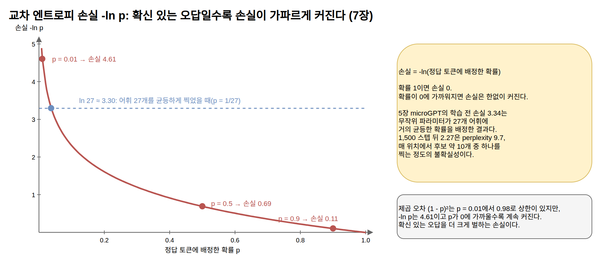

5장에서 학습 전 손실이 약 3.34였던 이유도 이 식으로 설명된다. 파라미터가 무작위인 모델은 어휘 27개에 거의 균등하게 확률 1/27을 배정하므로 손실이 ``-log(1/27) = ln(27) ≈ 3.30``에서 시작한다. softmax와 교차 엔트로피를 함께 쓰면 계산에도 이점이 있다. 손실을 로짓으로 미분하면 "예측 확률 - 정답(정답 토큰은 1, 나머지는 0)"이라는 간단한 식이 나와서, 확률이 정답에서 벗어난 만큼이 그대로 기울기가 된다. 4장의 자동 미분은 이 식을 몰라도 같은 결과를 계산하지만, 학습이 안정적으로 진행되는 배경에는 이 단순한 기울기가 있다. 앞 절의 softmax 표에 대입하면 이렇다.

----
softmax 확률: [0.66, 0.24, 0.10],  정답이 첫째 토큰이면 정답 벡터는 [1, 0, 0]
손실 = -ln(0.66) ≈ 0.42
로짓의 기울기 = [0.66 - 1, 0.24 - 0, 0.10 - 0] = [-0.34, 0.24, 0.10]
----

정답 토큰의 로짓은 올리고(기울기가 음수이므로 반대 방향으로 움직이면 커진다) 나머지 토큰의 로짓은 각자 배정받은 확률만큼 내리라는 뜻이다. 세 성분의 합은 항상 0이라서, 로짓 전체가 한쪽으로 밀리는 일 없이 확률만 정답 쪽으로 옮겨 간다.

=== 엔트로피와 perplexity

**엔트로피**는 확률 분포의 불확실성을 재는 값으로, 그 분포에서 뽑히는 결과의 평균 ``-log(확률)``이다.

----
H(P) = -Σ P(x) * log P(x)

P = [0.66, 0.24, 0.10]이면
H = -(0.66*ln 0.66 + 0.24*ln 0.24 + 0.10*ln 0.10) ≈ 0.85
세 후보가 균등하면 H = ln 3 ≈ 1.10 (최대)
----

한 토큰이 확률 1로 정해져 있으면 엔트로피는 0이고, V개 후보가 균등하면 ``ln(V)``로 최대가 된다. 두 분포 P와 Q 사이의 **교차 엔트로피** ``H(P, Q) = -Σ P(x) * log Q(x)``는 "실제 분포가 P인데 Q라고 믿고 부호화할 때의 평균 불확실성"이다. 학습 손실은 P가 정답 토큰에 확률 1을 몰아준 분포이고 Q가 모델의 분포인 특수한 경우라서, 합이 정답 항 하나만 남아 ``-log Q(정답)``이 된다. 손실이 낮다는 것은 모델이 데이터를 덜 놀라워한다는 뜻이다.

언어 모델 평가에서 자주 쓰는 **perplexity**는 평균 교차 엔트로피에 지수 함수를 적용한 값이다.

----
perplexity = exp(평균 손실)
----

로그 단위의 손실을 "몇 개 중 하나를 균등하게 찍는 것과 같은 불확실성인가"라는 개수 단위로 되돌린 것이다. 위의 분포 P는 perplexity가 ``exp(0.85) ≈ 2.3``으로, 후보 3개 가운데 하나를 균등하게 찍는 것보다 조금 나은 상태다. 평균 손실 3.3이면 perplexity는 약 27로, 매 위치에서 27개 후보를 놓고 균등하게 찍는 정도의 불확실성이라는 뜻이다. 5장에서 1,500 스텝 뒤에 도달한 평균 손실 2.27은 perplexity 약 9.7로, 후보 약 10개 중 하나를 찍는 정도까지 줄어든 것이다. 낮을수록 좋은 지표이며, 같은 토크나이저를 쓰는 모델끼리만 직접 비교할 수 있다.

.엔트로피와 perplexity. 뾰족한 분포일수록 엔트로피가 낮고, perplexity는 "몇 개 중 하나를 찍는 것과 같은가"로 읽힌다
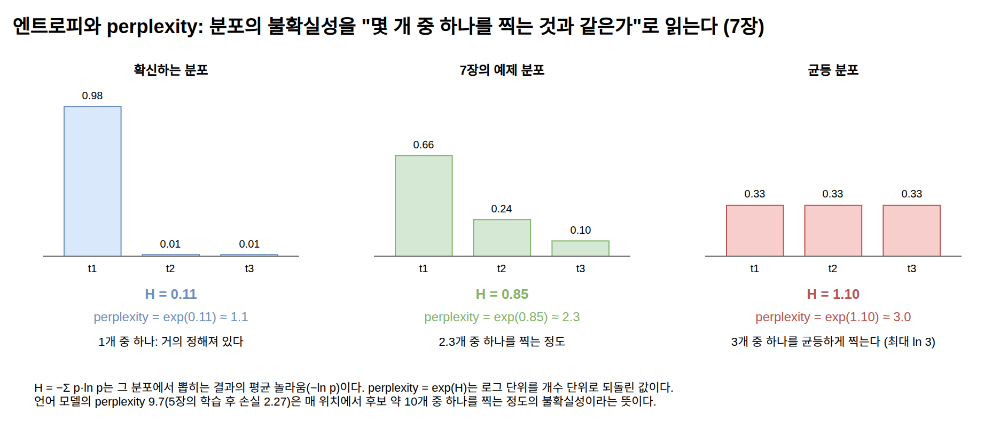

=== KL 발산: 두 분포 사이의 차이 재기

*KL 발산*(Kullback-Leibler divergence)은 두 확률 분포가 얼마나 다른지를 재는 값이다.

----
KL(P || Q) = Σ P(x) * log(P(x) / Q(x))

P = [0.7, 0.2, 0.1], Q = [0.5, 0.3, 0.2]이면
KL(P || Q) = 0.7*ln(0.7/0.5) + 0.2*ln(0.2/0.3) + 0.1*ln(0.1/0.2) ≈ 0.085
KL(Q || P) ≈ 0.092
----

P와 Q가 같으면 0이고, 다를수록 커지며, 음수가 되지 않는다. P를 기준으로 Q를 재는 값이라서 위의 예처럼 순서를 바꾸면 값이 달라진다(비대칭).

교차 엔트로피와는 정확한 관계식이 있다. `교차 엔트로피(P, Q) = 엔트로피(P) + KL(P || Q)`. 학습 데이터의 분포 P는 학습 중에 변하지 않으므로, 5장의 교차 엔트로피 손실을 최소화하는 것은 곧 모델의 분포를 데이터의 분포에 가깝게 만드는(KL을 줄이는) 일이다.

이 개념은 1부의 학습 기법들에서 반복해서 나타난다. 지식 증류(1장)에서 student가 teacher의 출력 확률 분포를 따라 배울 때의 손실이 KL 발산이다. RLHF(1장)에서는 반대 방향의 안전장치로 쓰인다. 보상 점수만 최대화하면 모델이 보상 모델의 허점을 파고드는 이상한 텍스트를 만들 수 있으므로(보상 해킹), 원래 SFT 모델의 분포에서 너무 멀어지면 벌점을 주는 KL 페널티를 목적 함수에 더한다. DPO는 이 KL 제약이 붙은 최적화 문제를 별도의 강화학습 없이 닫힌 형태로 풀어낸 결과다.

.KL 발산과 RLHF의 페널티. 왼쪽은 P와 Q의 항별 기여, 오른쪽은 보상에서 β·KL을 뺀 목적 함수가 최대가 되는 지점
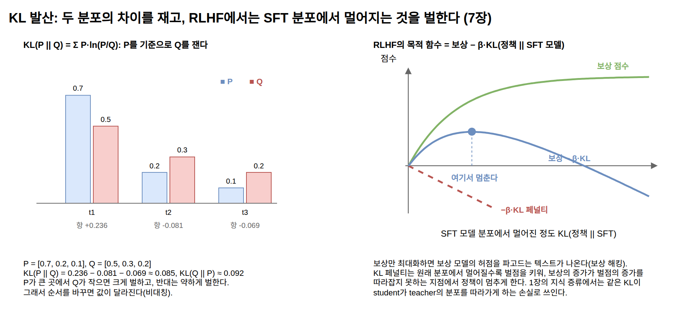

== 미분: 모델이 배우는 방향

=== 도함수와 그래디언트

*도함수*(미분)는 입력이 아주 조금 변할 때 출력이 변하는 비율이다. 고등학교 미적분에서 배운 그 도함수다. ``f(x) = x²``이면 도함수는 ``2x``이고, ``x = 3``에서의 기울기는 6이다. x를 0.001만큼 키우면 f는 약 0.006만큼 커진다. 기울기의 부호는 방향을, 크기는 민감도를 알려 준다.

입력이 여러 개인 함수에서 다른 입력은 고정하고 하나만 움직여 구한 기울기가 **편미분**이고, 모든 입력에 대한 편미분을 모은 벡터가 *그래디언트*(gradient)다.

----
f(x, y) = x² + 3y 이고 (x, y) = (1, 2)이면
∂f/∂x = 2x = 2,  ∂f/∂y = 3
그래디언트 = [2, 3]
----

x를 0.001 늘리면 f는 0.002, y를 0.001 늘리면 0.003 커진다는 뜻이다. 그래디언트는 함수가 가장 가파르게 커지는 방향을 가리키는 벡터이기도 하다. microGPT의 파라미터는 4,192개이므로 손실의 그래디언트는 4,192차원 벡터이고, 4장에서 각 파라미터의 `grad` 필드에 채워지던 "네가 조금 커지면 손실이 얼마나 변하는지"가 그 성분 하나다.

.그래디언트와 등고선. 그래디언트는 등고선에 수직인 가장 가파른 방향이고, 경사 하강법은 그 반대 방향으로 지그재그를 그리며 최저점에 다가간다
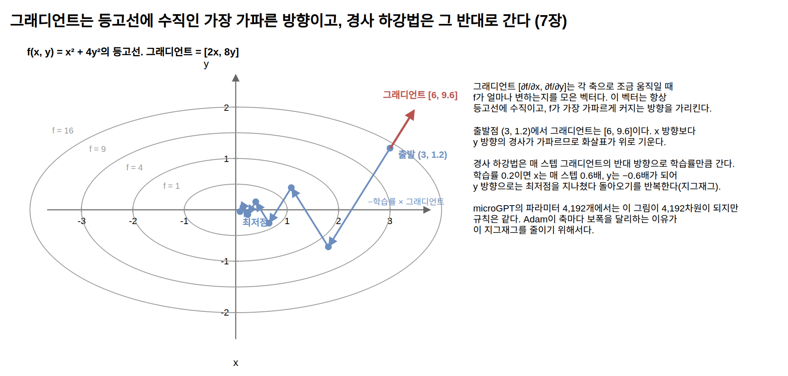

=== 체인 룰

**체인 룰**은 합성 함수의 기울기 계산 규칙이다. ``y = f(g(x))``일 때 x에 대한 y의 기울기는 두 로컬 기울기의 곱이다.

----
dy/dx = dy/dg * dg/dx
----

``y = (2x + 1)²``을 ``x = 1``에서 미분해 보자. 안쪽 함수를 ``g = 2x + 1``로 두면 ``g = 3``, ``y = g² = 9``다. 바깥 함수의 로컬 기울기는 ``dy/dg = 2g = 6``, 안쪽 함수의 로컬 기울기는 ``dg/dx = 2``이므로 ``dy/dx = 6 * 2 = 12``다. 실제로 x를 1.001로 바꾸면 y는 9.012가 되어, x가 0.001 커질 때 y가 0.012 커진다.

.체인 룰과 역전파. forward가 값을 앞으로 계산하고, backward가 끝에서부터 로컬 기울기를 곱해 나간다
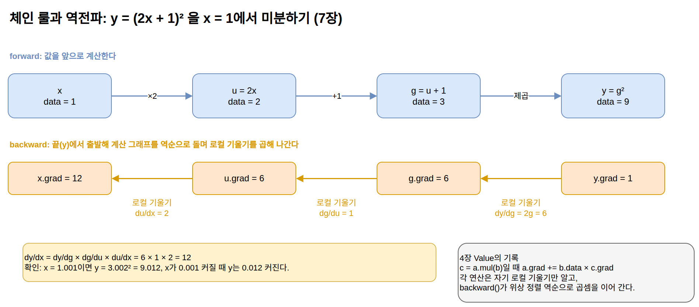

연산이 수만 번 이어져도 규칙은 같다. 각 연산이 자기 로컬 기울기만 알고 있으면, 끝에서부터 곱해 나가며 모든 파라미터의 기울기를 얻을 수 있다. 4장의 역전파가 이 곱셈을 계산 그래프 역순으로 수행하는 절차이고, `Value` 타입에 람다로 저장되던 것이 바로 이 로컬 기울기다. 곱셈 ``c = a.mul(b)``의 람다가 ``a.grad += b.data * c.grad``인 것은 c를 a로 미분한 로컬 기울기가 b이기 때문이다. 기울기를 대입하지 않고 더하는(`+=`) 이유는 같은 값이 두 곳 이상에서 쓰였을 때 각 경로에서 온 기울기를 합해야 하기 때문이다.

=== 경사 하강법과 학습률

**경사 하강법**은 그래디언트를 손에 넣은 다음의 이동 규칙이다.

----
파라미터 = 파라미터 - 학습률 * 기울기
----

기울기는 손실이 커지는 방향을 가리키므로 그 반대로 움직인다. 학습률은 한 걸음의 보폭이다. ``f(x) = x²``에서 ``x = 3``으로 출발해 학습률 0.1로 움직이면 x는 3, 2.4, 1.92, 1.54, 1.23으로 최저점 0에 다가가고, 10스텝 뒤에는 ``3 * 0.8^10 ≈ 0.32``가 된다. 걸음마다 기울기 자체가 작아지므로 보폭도 함께 줄어든다. 학습률을 1.1로 잡으면 3, -3.6, 4.32, -5.18로 최저점을 지나쳐 반대편으로 더 멀리 튀는 일이 반복되어 발산한다. 너무 작으면 학습이 느리고, 너무 크면 이렇게 발산한다.

두 경우의 차이는 한 스텝의 갱신식을 정리하면 보인다.

----
x - 학습률 * 2x = (1 - 2 * 학습률) * x

학습률 0.1: 매 스텝 0.8배   → 3, 2.4, 1.92, ...  (수렴)
학습률 1.1: 매 스텝 -1.2배  → 3, -3.6, 4.32, ... (발산)
----

앞의 ``0.8^10``이 이 배율의 10제곱이다. 이 곡선에서는 배율의 절댓값이 1보다 작아야, 곧 학습률이 1보다 작아야 수렴하고, 곡선이 가파를수록(2x의 2가 클수록) 그 경계는 낮아진다. 손실 곡면의 가파름을 미리 알 수 없으므로 실제 학습에서는 학습률을 실험으로 고른다.

.경사 하강법과 학습률. 학습률 0.1은 최저점으로 수렴하고 1.1은 발산한다
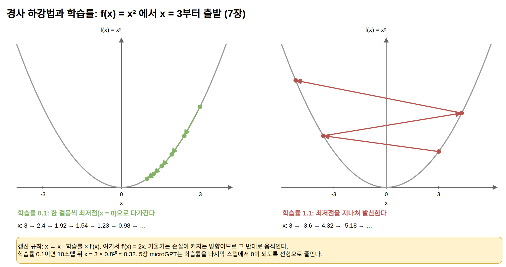

실제 학습에서는 학습률을 고정하지 않고 스텝에 따라 바꾸는 일이 흔하다. 5장의 microGPT는 학습률을 마지막 스텝에서 0이 되도록 선형으로 줄인다. 처음에는 큰 보폭으로 빠르게 내려가고, 최저점 근처에서는 보폭을 줄여 지나치지 않게 하는 것이다.

=== Adam: 보폭을 파라미터마다 조절하기

5장의 옵티마이저 Adam은 위의 기본 규칙에 두 가지 이동 평균을 더한 것이다. 첫째는 기울기의 이동 평균 m이다. 스텝마다 ``m = β1*m + (1-β1)*기울기``로 갱신하므로, 최근 기울기들이 같은 방향이면 m이 커지고 방향이 요동치면 서로 상쇄되어 작아진다. 둘째는 기울기 제곱의 이동 평균 v로, 그 파라미터의 기울기가 평소에 얼마나 큰지를 기록한다. 갱신량은 ``학습률 * m / sqrt(v)``다. 기울기가 늘 큰 파라미터는 ``sqrt(v)``로 나뉘어 보폭이 줄고, 늘 작은 파라미터는 보폭이 커진다. 파라미터 4,192개가 각자 다른 학습률을 쓰는 것과 같은 효과다. ``sqrt(v)``에 아주 작은 수 ε을 더하는 것은 0으로 나누는 일을 막는 장치다. 두 이동 평균이 0에서 시작하므로 초기 몇 스텝은 실제보다 작게 추정되는데, 5장 코드의 ``1 - β^step``으로 나누는 부분이 이것을 보정한다. 5장 코드의 값(β1이 0.9, β2가 0.95)으로 첫 스텝을 따라가면 보정의 효과가 보인다.

----
첫 스텝의 기울기가 g이면
이동 평균: m = 0.1 * g,  v = 0.05 * g²
보정:      m / (1 - 0.9) = g,  v / (1 - 0.95) = g²
갱신량:    학습률 * g / sqrt(g²) = 학습률 * (g의 부호)

보정이 없으면: 학습률 * 0.1g / sqrt(0.05g²) ≈ 0.45 * 학습률
----

보정한 첫 스텝의 갱신량이 기울기의 크기와 무관하게 정확히 학습률만큼이라는 점이 Adam의 성격을 보여 준다. Adam의 보폭을 정하는 것은 기울기의 크기가 아니라 부호와 그 일관성이다. 그래서 단순 경사 하강법보다 학습률 선택에 덜 민감하고, 기울기의 크기가 파라미터마다 수천 배 다른 신경망을 학습률 하나로 학습할 수 있다.

== 평균과 분산: 값의 규모를 관리하기

=== 평균, 분산, 표준편차

**평균**은 값들의 중심이고, **분산**은 값들이 평균에서 흩어진 정도(편차 제곱의 평균)다. 분산의 제곱근이 **표준편차**로, 단위가 원래 값들과 같다.

----
값:     [2, 4, 4, 4, 5, 5, 7, 9]      평균 5
편차:   [-3, -1, -1, -1, 0, 0, 2, 4]
분산:   (9 + 1 + 1 + 1 + 0 + 0 + 4 + 16) / 8 = 4
표준편차: sqrt(4) = 2
----

신경망에서 이 개념이 중요한 이유는 값의 규모 관리 때문이다. 층을 거칠수록 값의 분산이 커지거나 작아지기만 하면 기울기가 폭주하거나 소멸해서 학습이 진행되지 않는다.

=== 정규화와 sqrt(d) 스케일링

5장의 정규화(RMSNorm)는 벡터를 자기 크기로 나눠 규모를 일정하게 되돌리는 장치다. 벡터 성분들의 제곱 평균의 제곱근(RMS, root mean square)으로 각 성분을 나누면 결과 벡터의 RMS가 1이 된다. 성분들의 평균이 0이면 RMS는 표준편차와 같으므로, 이것은 "표준편차를 1로 맞추는" 정규화다. 원조 트랜스포머의 LayerNorm은 평균을 먼저 빼고 표준편차로 나누는데, RMSNorm은 평균 빼기를 생략한 것이다.

어텐션 점수를 ``headDim``의 제곱근으로 나누던 것(5장)도 같은 원리다. 서로 독립인 확률 변수들을 더하면 분산은 각 분산의 합이 된다. 평균 0, 분산 1인 독립적인 값들로 이루어진 d차원 벡터 두 개를 내적하면, 더하는 항 ``q_i * k_i``가 각각 평균 0, 분산 1이고 항이 d개이므로 결과의 분산이 d가 되고 표준편차는 ``sqrt(d)``가 된다.

----
Var(q_1 k_1 + q_2 k_2 + ... + q_d k_d) = 1 + 1 + ... + 1 = d
Var((q·k) / sqrt(d)) = d / d = 1
----
 d가 256이면 점수의 표준편차가 16이라는 뜻이고, 그 크기의 로짓을 softmax에 넣으면 앞 절에서 본 대로 점수 차이 하나하나가 수천 배의 확률 배율로 벌어져 한 토큰에 확률이 몰린다. 내적을 ``sqrt(d)``로 나누면 차원이 몇이든 점수의 분산이 1 근처로 유지된다.

.값의 규모 관리. 블록을 지날수록 커지거나 작아지는 표준편차를 RMSNorm이 1로 되돌리고, sqrt(d)가 어텐션 점수의 폭을 16에서 1로 맞춘다
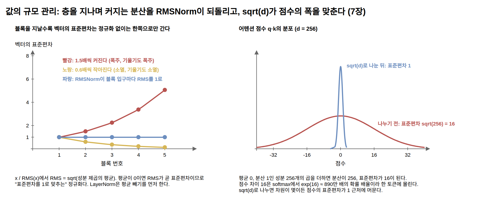

=== 정규 분포와 중심 극한 정리

**정규 분포**는 평균을 중심으로 좌우 대칭인 종 모양의 분포로, 평균과 표준편차 두 값으로 모양이 정해진다. 값의 약 68%가 평균 ±1 표준편차 안에, 약 95%가 ±2 표준편차 안에 들어온다. 고등학교 확률과 통계에서 배운 그 분포다.

정규 분포가 곳곳에서 나타나는 이유는 **중심 극한 정리**다. 서로 독립인 무작위 값을 여러 개 더하면, 개별 값이 어떤 분포를 따르든 그 합은 정규 분포에 가까워진다. 앞 절에서 d차원 내적의 분산이 d가 된다고 했는데, 항이 많은 합이라는 같은 이유로 그 내적값의 분포 자체도 종 모양에 가까워진다.

LLM에서 정규 분포가 실무와 만나는 자리는 두 곳이다. 첫째, 신경망의 가중치 초기화는 평균 0의 정규 분포에서 작은 값을 뽑는 것이 표준이다. 둘째, 학습이 끝난 가중치들의 분포도 대체로 평균 0의 종 모양을 유지한다. 8장에서 다룰 NF4 양자화가 이 관찰 위에 서 있다. 4비트로 표현할 수 있는 값은 16개뿐인데, 이 16개 격자점을 같은 간격으로 깔면 값이 거의 없는 꼬리 쪽 격자점이 낭비된다. NF4는 정규 분포를 확률이 같은 16개 구간으로 나누고 각 구간의 중앙값을 격자점으로 삼아, 값이 몰린 0 근처에 격자점을 촘촘히 둔다. 표준 정규 분포를 이렇게 나누면 0 근처 구간의 폭은 약 0.16이고 가장 바깥 경계는 ±1.53이라서, 그 너머의 꼬리 전체(각각 6.25%)가 구간 하나에 담긴다. 8장의 측정에서 같은 16개 점으로 균등 격자는 RMS 오차 0.1424, 분위수 격자는 0.1058을 냈다. 값이 어디에 몰리는지 알면 표현의 정밀도를 그쪽에 배치할 수 있다.

.정규 분포와 양자화 격자. 값이 몰린 곳에 격자점을 촘촘히 두면 같은 개수로 오차가 줄어든다
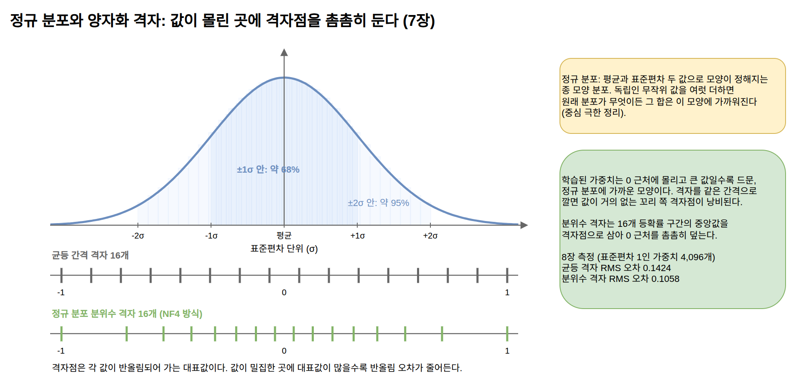

== 데이터의 구조: 상관, 주성분, 군집

=== 공분산과 상관계수

*공분산*(covariance)은 두 변수가 함께 움직이는 정도다. 각 변수에서 평균을 뺀 값끼리 곱해 평균낸 것으로, 한쪽이 클 때 다른 쪽도 큰 경향이면 양수, 반대로 움직이면 음수, 무관하면 0 근처가 된다. 분산은 자기 자신과의 공분산이다.

----
cov(x, y) = 평균((x - x̄) * (y - ȳ))
상관계수  = cov(x, y) / (σ_x * σ_y)
----

공분산을 두 변수의 표준편차로 나눠 -1에서 1 사이로 정규화한 것이 **상관계수**다. 그런데 이 식을 벡터의 언어로 다시 읽으면, 분자는 평균을 뺀 두 배열의 내적을 개수로 나눈 것이고 분모는 그 두 배열의 길이를 개수로 나눈 것이다. 개수가 약분되므로 상관계수는 "평균을 뺀 두 값 배열의 코사인 유사도"와 정확히 같은 계산이다. 11장의 벡터 검색에 쓸 코사인 유사도가 통계의 상관계수와 같은 공식이라는 뜻이고, 벡터 검색은 "질의와 상관이 높은 문서 찾기"라고 바꿔 말할 수 있다.

=== 주성분 분석

변수가 여러 개면 모든 쌍의 공분산을 행렬로 모은 **공분산 행렬**이 된다. 이 행렬에서 데이터의 주된 방향을 찾는 기법이 *주성분 분석*(PCA, Principal Component Analysis)이다. 고차원 공간에 흩어진 데이터에서 분산이 가장 큰 방향(제1주성분)을 찾고, 그와 수직인 방향 가운데 분산이 가장 큰 방향(제2주성분)을 찾는 일을 반복한 뒤, 앞의 몇 방향만 남긴다. 분산이 가장 큰 방향이란 공분산 행렬이 가장 크게 늘리는 방향인데, 행렬을 곱해도 방향은 바뀌지 않고 길이만 λ배가 되는 벡터를 *고유벡터*(eigenvector), 그 배율 λ를 고유값이라고 부른다. 공분산 행렬의 고유벡터가 주성분이고, 고유값이 그 방향의 분산이다.

----
C = [[2, 1],     x와 y의 분산이 각각 2, 공분산이 1
     [1, 2]]

C × [1, 1]  = [3, 3]  = 3 × [1, 1]     고유값 3, 제1주성분 방향 [1, 1]
C × [1, -1] = [1, -1] = 1 × [1, -1]    고유값 1, 제2주성분 방향 [1, -1]
----

x와 y가 함께 커지는 대각선 방향의 분산이 3, 그와 수직인 방향의 분산이 1이다. 제1주성분 하나만 남겨도 전체 분산 4 가운데 3, 곧 75%가 보존된다.

.고유벡터. 행렬 C가 단위 벡터 8개를 변환할 때 [1, 1]과 [1, −1] 방향만 방향을 유지하고 길이만 3배와 1배가 된다
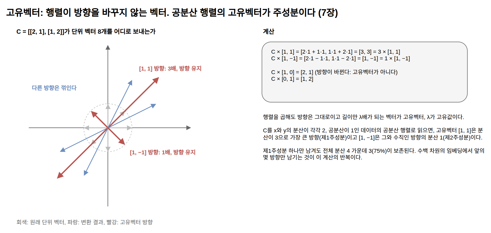

수백 차원의 데이터라도 실제 변동의 대부분이 몇 개의 방향으로 설명된다면, 그 방향들의 좌표만 남겨도 잃는 정보가 작다. 데이터 행렬을 앞의 k개 주성분만으로 다시 쓰는 것은 앞 절의 저랭크 근사와 같은 일이다. 수백 차원의 임베딩 벡터들을 2차원 그림으로 펼쳐 시각화할 때 흔히 쓰이는 도구가 PCA이고, 3장의 activation steering이 쓰는 "정직함 방향" 같은 방향 벡터도 활성값 데이터에서 통계적으로 뽑아낸 방향이며, 그 도구로 주성분 분석이 쓰이기도 한다.

=== 판별 분석

주성분 분석이 "데이터가 가장 넓게 퍼진 방향"을 찾는다면, *판별 분석*(discriminant analysis)은 "두 집단을 가장 잘 구분하는 방향"을 찾는다. Fisher의 선형 판별 분석은 그 방향에서 두 집단의 평균이 서로 멀고 각 집단 안의 흩어짐은 작도록, 집단 사이 분산과 집단 안 분산의 비율을 최대로 만드는 방향을 고른다. 가장 단순한 형태는 두 집단의 평균 벡터를 빼서 그 차이를 방향으로 삼는 것이다.

3장의 activation steering이 쓰는 방향 벡터가 이 아이디어로 만들어진다. 모델이 정직한 답변을 생성할 때의 활성값들과 그렇지 않을 때의 활성값들을 모아, 두 집단의 평균 차이를 "정직함 방향"으로 삼는 식이다. 고차원 활성값 공간에서 어떤 성향이 방향 하나로 표현된다는 관찰이, 통계학이 오래 다듬어 온 판별 분석의 언어로 그대로 서술된다.

=== k-평균 군집화

*k-평균 군집화*(k-means clustering)는 데이터를 k개의 무리로 나누는 기법이다. 대표점 k개를 놓고 "각 데이터를 가장 가까운 대표점에 배정한다, 각 대표점을 배정된 데이터들의 평균으로 옮긴다"를 반복하면, 대표점들이 데이터가 밀집한 곳으로 이동하며 자리를 잡는다. 이 반복 절차를 Lloyd 알고리즘이라고 부른다.

.데이터의 구조를 찾는 세 기법. 주성분 분석은 퍼진 방향을, 판별 분석은 구분하는 방향을, k-평균은 대표점을 찾는다
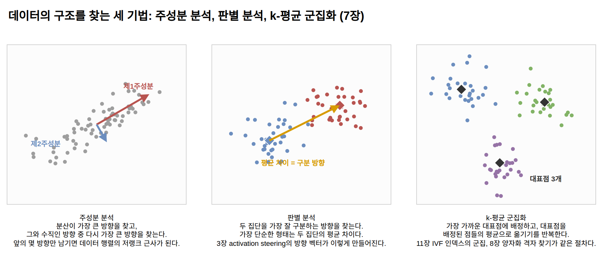

임베딩 공간은 비슷한 것끼리 가까이 놓이도록 학습된 공간이므로, 그 안에서 대표점을 찾는 k-평균이 본문 여러 곳에서 쓰인다. 11장에서 이름만 소개할 Vector DB 인덱스 가운데 IVF가 이 방식이다. 전체 벡터를 k개 군집으로 미리 나눠 두고, 검색 때는 질의와 가까운 군집 몇 개만 뒤져서 전수 비교를 피한다. 같이 언급할 PQ도 벡터를 조각내어 조각마다 k-평균으로 대표점 목록(코드북)을 만들고, 각 조각을 가장 가까운 대표점의 번호로 바꿔 저장하는 압축 기법이다. 14장의 GraphRAG가 "군집별 요약을 미리 생성"할 때의 군집도 군집화의 결과물이다.

8장의 양자화와도 이어진다. "격자를 어디에 둘 것인가"라는 질문에 NF4는 분포(정규 분포)를 안다는 전제로 분위수에 격자를 놓았는데, 분포를 모른 채 데이터에서 직접 격자를 찾는 일반해가 1차원 k-평균이다. 값이 밀집한 곳에 대표점이 몰리는 최적의 양자화 격자가 같은 반복 절차로 나온다. 대표점을 잘 고르는 문제와 정밀도를 잘 배치하는 문제가 같은 문제라는 뜻이다.

== 회귀: 가장 작은 신경망

=== 선형 회귀와 최소제곱법

**선형 회귀**는 데이터에 가장 잘 맞는 직선 ``y = ax + b``를 찾는 기법이다. "가장 잘 맞는"의 기준은 예측과 실제의 차이를 제곱해 더한 값(오차 제곱합)을 최소로 만드는 것이고(최소제곱법), 입력이 여러 개면 직선이 평면으로, 계수 a가 벡터로 늘어날 뿐 식의 형태는 같다. 입력이 d개인 선형 회귀의 예측은 계수 벡터와 입력 벡터의 내적에 상수를 더한 것이다. 입력이 하나일 때는 해가 앞 절의 공분산과 분산으로 바로 쓰인다.

----
a = cov(x, y) / var(x),   b = ȳ - a * x̄

x = [1, 2, 3, 4], y = [2, 4, 5, 8]이면
cov(x, y) = 2.375, var(x) = 1.25  →  a = 1.9,  b = 4.75 - 1.9 * 2.5 = 0
----

기울기 a가 공분산을 분산으로 나눈 값이므로, 회귀 계수는 상관계수와 같은 재료로 만들어진다. 상관계수가 -1에서 1 사이로 정규화한 방향 일치도라면, 회귀 계수는 그 관계를 y의 단위로 되돌린 값이다.

선형 회귀는 이 책 곳곳에 있다. 신경망의 한 층은 다변수 선형 회귀 여러 개(출력 차원 수만큼)에 비선형 함수를 붙인 것이므로, LLM은 선형 회귀를 수억 개 쌓아 올린 구조로 볼 수도 있다. "손실을 정의하고 그것을 최소화하는 파라미터를 찾는다"는 학습의 형태 자체가 최소제곱법의 일반화이며, 선형 회귀는 그 해를 공식으로 바로 구할 수 있지만 5장의 학습 루프는 경사 하강법으로 찾는다. 8장의 GPTQ가 양자화 오차를 보상할 때 최소화하는 대상도 레이어 출력의 오차 제곱합이고, 이 장 뒤에서 볼 스케일링 법칙의 계수 추정도 로그를 취한 좌표에서 직선을 맞추는 회귀다.

=== 로지스틱 회귀와 시그모이드

**로지스틱 회귀**는 선형 회귀의 출력을 시그모이드 함수에 통과시켜 0과 1 사이의 확률로 바꾼 분류 기법이다.

----
sigmoid(z) = 1 / (1 + exp(-z))

z = -2 → 0.12,  z = 0 → 0.5,  z = 2 → 0.88
----

시그모이드의 도함수는 ``sigmoid(z) * (1 - sigmoid(z))``로, 출력이 0.5일 때 0.25로 가장 크고 출력이 0이나 1에 가까워지면 0에 가까워진다. 5장에서 softmax가 한 토큰에 확률을 몰아주면 기울기가 거의 흐르지 않는다고 한 것이 이 성질이다. 출력이 이미 극단에 있으면 로짓을 조금 움직여도 확률이 거의 변하지 않으므로 손실도 변하지 않고, 배울 신호가 사라진다.

시그모이드는 선택지가 두 개일 때의 softmax와 같은 함수다. 로짓이 ``[z, 0]``인 두 후보에 softmax를 적용하면 첫 후보의 확률은 ``exp(z) / (exp(z) + 1)``이고, 분자와 분모를 ``exp(z)``로 나누면 위의 식이 된다. 로지스틱 회귀의 손실(로그 손실)은 교차 엔트로피와 같은 식이다. 그러므로 LLM의 마지막 단계, 즉 `lmHead` 행렬 곱에 softmax를 적용하고 교차 엔트로피로 학습하는 부분(5장)은 선택지가 어휘 크기만큼 있는 로지스틱 회귀(다항 로지스틱 회귀)와 같은 구조다.

1장의 선호 학습에도 이 형태가 있다. RLHF의 보상 모델은 "답변 A가 B보다 선호될 확률 = sigmoid(A의 점수 - B의 점수)"라는 모형(Bradley-Terry 모형)으로 학습되고, DPO의 손실도 같은 시그모이드 위에 서 있다. 사람의 선호라는 정답 없는 품질도 학습의 형태로는 로지스틱 회귀로 환원된다.

=== 다중공선성과 분산 표현

회귀분석을 배울 때 함께 배우는 *다중공선성*(multicollinearity)도 이 대비 위에서 다시 읽을 수 있다. 입력 변수들끼리 강하게 상관되어 있으면 계수를 어느 변수에 배분해도 예측이 비슷해져서, 예측은 멀쩡한데 개별 계수의 추정이 불안정해지고 해석이 무의미해지는 현상이다. 통계 모형에서 이것이 문제인 이유는 계수 하나하나를 해석하려 하기 때문이다. LLM은 그 극단에 있다. 파라미터들이 서로 얽혀 있어 어느 파라미터가 무엇을 담당하는지 특정할 수 없지만, 애초에 개별 해석을 포기하고 예측 성능만 취하므로 학습에는 지장이 없다. 1장에서 모델 레이어의 정보가 분산 표현이라 선택적으로 열람하거나 삭제할 수 없다고 한 것, 그리고 모델 편집이 연구 단계에 머무는 이유가 이 성질의 결과다. 해가 하나로 정해지지 않는다는 같은 성질이, 계수를 읽으려는 통계학에서는 결함이고 출력만 쓰는 LLM에서는 감수하는 전제가 된다.

== 확률 과정과 결정: 마르코프 체인과 벨만 방정식

=== 마르코프 체인

*마르코프 체인*(Markov chain)은 "다음에 일어날 일이 현재 상태에만 의존하고, 거기까지 온 경로에는 의존하지 않는다"는 성질(마르코프 성질)을 만족하는 확률 과정이다. 상태마다 다음 상태로 옮겨 갈 확률이 정해져 있고, 그 확률표만 있으면 과정 전체를 전개할 수 있다.

확률 절에서 본 n-gram 언어 모델이 정확히 마르코프 체인이다. 상태를 "직전 n-1개 토큰"으로 잡고, 다음 토큰으로 옮겨 갈 확률표를 말뭉치에서 센 것이다. 4장의 이름 데이터로 말하면, 직전 글자가 "a"일 때 다음 글자가 "n"일 확률, "r"일 확률을 이름 목록에서 세어 표로 만든 것이 바이그램 모델이다. 4장의 이름 2,000개에서 실제로 세면 다음과 같다.

----
직전 글자가 a일 때 (a는 2,289번 등장)
  이름의 끝  0.32    n  0.14    r  0.10    l  0.09    ...
----

이 표의 한 줄이 상태 a에서 나가는 전이 확률이고, 27개 상태(글자 26개와 BOS)의 줄을 모두 모은 27×27 표가 이 체인의 전이 행렬이다. 5장의 학습 전 모델은 모든 줄이 1/27인 균등한 전이 행렬과 같은 성적을 냈고, 학습이 진행되면서 이런 표를 향해 움직였다고 볼 수 있다. 언어를 확률 과정으로 다루는 일 자체가 섀넌의 마르코프 체인 실험에서 출발했다.

.마르코프 체인의 상태. 바이그램은 직전 글자 하나가 상태이고, LLM은 컨텍스트 윈도우 안의 토큰 열 전체가 상태다
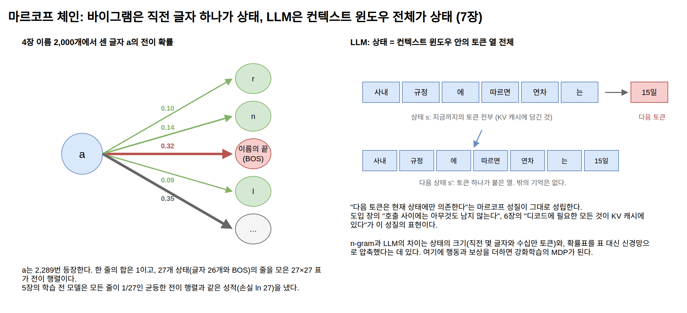

LLM도 마르코프 체인으로 볼 수 있다. 상태를 "컨텍스트 윈도우 안의 토큰 열 전체"로 잡으면, 다음 토큰은 그 상태에만 의존하고 상태 밖의 어떤 기억에도 의존하지 않는다. 도입 장의 "호출 사이에는 아무것도 남지 않는다"가 이 성질의 표현이고, 6장에서 디코드에 필요한 모든 것이 KV 캐시에 담겨 있었던 것도 KV 캐시가 곧 이 체인의 상태이기 때문이다. n-gram과 LLM의 차이는 상태의 크기(직전 몇 토큰과 수십만 토큰), 그리고 확률표를 표 대신 신경망으로 압축했다는 것에 있다. 이 상태 개념에 행동과 보상을 더하면 다음 절의 강화학습이 된다.

=== 강화학습과 벨만 방정식

1장의 RLHF와 RLVR은 강화학습(reinforcement learning)이다. 강화학습은 네 가지 요소로 서술된다. 지금 처한 *상태*(state), 상태에서 고르는 *행동*(action), 행동의 결과로 받는 *보상*(reward), 그리고 상태를 보고 행동을 고르는 규칙인 *정책*(policy)이다. 상태가 앞 절의 마르코프 성질을 만족한다는 전제가 깔려 있어서, 이 구조를 마르코프 결정 과정(MDP, Markov Decision Process)이라고 부른다.

LLM 학습에 대응시키면 이렇다. 상태는 지금까지 생성된 토큰 열, 행동은 다음 토큰 하나의 선택, 정책은 모델 그 자체다. 모델이 내놓는 다음 토큰의 확률 분포가 곧 행동 선택 규칙이기 때문이다. 보상은 답변이 완성된 뒤에 온다. RLHF에서는 보상 모델의 점수, RLVR에서는 채점기의 판정이다.

.토큰 생성을 마르코프 결정 과정으로 보기. 상태는 토큰 열, 행동은 다음 토큰, 보상은 답변이 끝난 뒤 한 번 온다
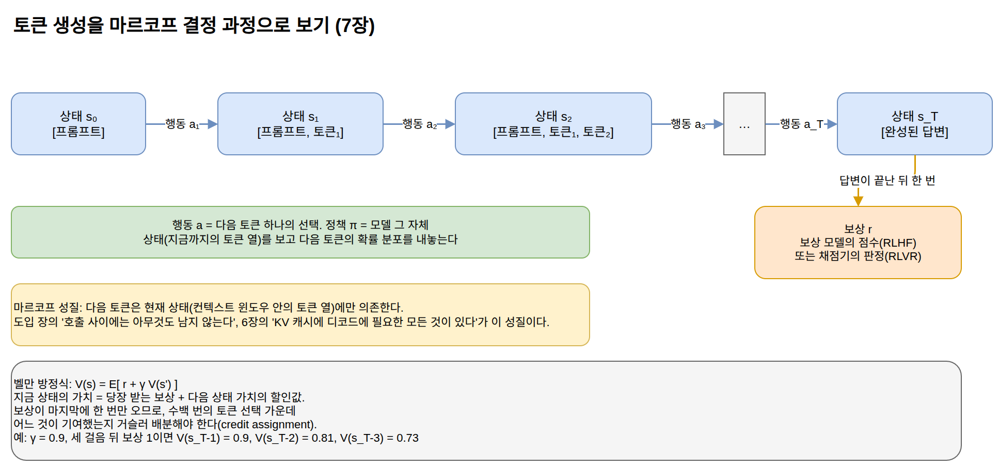

*가치 함수* V(s)는 상태 s에서 출발했을 때 앞으로 받게 될 보상의 기대 합이다. *벨만 방정식*(Bellman equation)은 이 가치 함수가 만족하는 재귀 관계다.

----
V(s) = E[ r + γ * V(s') ]
----

지금 상태의 가치는 "당장 받는 보상 r"에 "다음 상태 s'의 가치"를 더한 것의 기댓값과 같다는 뜻이다. γ(감마)는 0과 1 사이의 할인율로, 미래의 보상을 현재보다 얼마나 낮게 칠지를 정한다. 한 걸음 갈 때마다 γ가 거듭 곱해지므로 먼 미래의 보상은 γ, γ², γ³처럼 할인되는데, 이것은 고등학교에서 배운 등비수열이다. γ가 0.9이고 세 걸음 뒤에 보상 1이 온다면 마지막 직전 상태의 가치는 0.9, 그 앞은 0.81, 그 앞은 0.73이다. 공비 γ가 1보다 작으면 무한히 이어지는 보상의 합도 등비급수처럼 유한하게 수렴하므로, 할인율은 "앞으로 받을 보상의 합"이라는 양이 발산하지 않게 만드는 장치이기도 하다. 긴 문제를 "한 걸음과 그 나머지"로 쪼개는 이 재귀가 강화학습 알고리즘 대부분의 출발점이다. 이 재귀에서 "나머지"의 가치를 상태만의 함수 V(s')로 쓸 수 있는 것은 마르코프 성질 덕분이다. 상태가 미래를 판단하는 데 충분하지 않다면 나머지의 가치는 지나온 경로에 따라 달라져서 이렇게 쪼갤 수 없다.

LLM의 강화학습이 어려운 이유도 이 대응에서 보인다. 보상이 답변의 마지막에 한 번만 오므로, 수백 개의 토큰 선택 가운데 어느 것이 좋은 결과에 기여했는지를 거슬러 배분해야 한다(credit assignment 문제). RLHF에 주로 쓰이는 PPO가 정책(모델)과 함께 가치 함수를 추정하는 신경망을 따로 두는 이유가 이 배분 때문이고, 그 추정의 바탕에 벨만 방정식이 있다.

== 규모와 측정의 통계

=== 스케일링 법칙: 손실을 예측하는 멱법칙

*멱법칙*(power law)은 `y = a * x^(-b)` 형태의 관계다. 양변에 로그를 취하면 ``log y = log a - b * log x``가 되어, 두 축 모두 로그인 그래프에서 기울기가 -b인 직선으로 나타난다. 그래서 측정값 몇 개를 로그 좌표에 찍고 직선을 맞추면(앞 절의 선형 회귀) 계수 a와 b를 추정할 수 있다.

LLM에서 확인된 경험 법칙은, 사전학습 손실이 파라미터 수 N과 학습 토큰 수 D 각각에 대해 멱법칙으로 감소한다는 것이다. 널리 쓰이는 형태는 다음과 같다.

----
손실(N, D) = E + A / N^α + B / D^β
----

E는 아무리 키워도 남는 손실의 바닥이고, 뒤의 두 항이 모델 크기와 데이터 양을 키울수록 줄어드는 부분이다. Chinchilla 연구가 실측으로 맞춘 계수는 E가 1.69, A가 406.4, B가 410.7, α가 0.34, β가 0.28이다.

----
N = 700억, D = 1.4조:  1.69 + 406.4 / (7×10^10)^0.34 + 410.7 / (1.4×10^12)^0.28 ≈ 1.94
N = 70억,  D = 1.4조:  ≈ 2.04
----

α가 0.34라는 것은 N을 10배 키울 때 둘째 항이 ``10^0.34 ≈ 2.2``분의 1로 줄어든다는 뜻이다. 비용을 열 배 들여도 손실의 한 항만 절반 남짓 줄어드는, 수확 체감의 관계다.

.스케일링 법칙. 보통 축에서는 급히 떨어지다 완만해지는 곡선이 로그-로그 축에서는 기울기 −α인 직선이 되어, 작은 모델의 측정값으로 큰 모델의 손실을 외삽할 수 있다
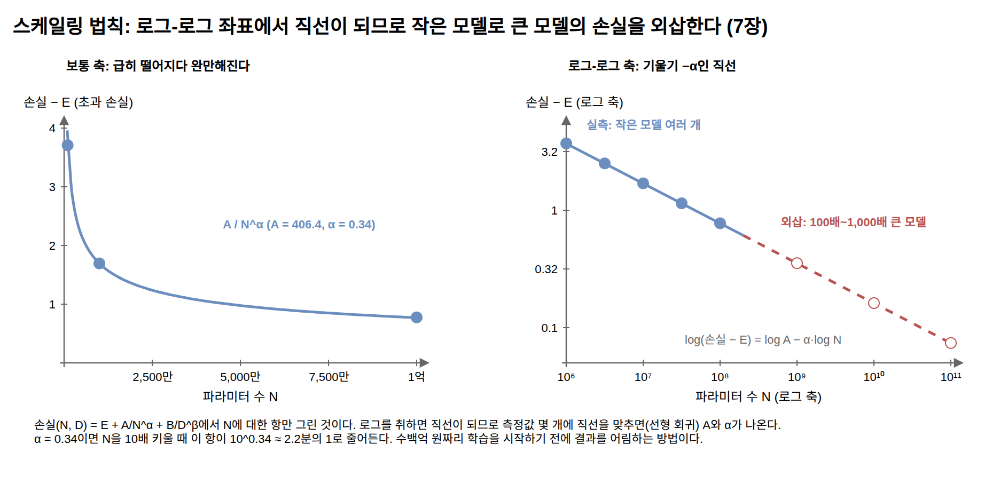

이 공식의 실무적 의미는 두 가지다. 첫째, 계산 예산이 정해져 있을 때 그 예산을 모델 크기와 데이터 양에 어떻게 나눌지가 계산으로 나온다. 이 계산을 수행한 Chinchilla 연구의 결론이 "파라미터 1개당 약 20토큰"이라는 균형점이었고, 1장 규모의 감각에서 본 "수조 토큰"이라는 자릿수가 이런 계산에서 나온다. 다만 최근 공개 모델들은 이 균형점보다 데이터를 훨씬 많이 쓰는 쪽으로 이동했다. 학습 비용은 한 번 들지만 추론 비용은 요청마다 들기 때문에(6장), 같은 품질이라면 작은 모델을 오래 학습시키는 쪽이 서빙에 유리해서다.

둘째, 손실이 예측 가능하다는 사실 자체가 프런티어 모델 개발의 방법이 된다. 작은 모델 여러 개를 학습시켜 멱법칙의 계수를 추정하면, 수백 배 큰 모델의 손실을 학습 전에 외삽할 수 있다. 수백억 원짜리 학습을 시작하기 전에 결과를 어림할 수 있다는 뜻이다.

=== 검색의 통계: TF-IDF와 BM25

4부의 키워드 검색도 통계 위에 서 있다. **TF-IDF**는 두 빈도의 곱이다. 단어가 그 문서에 자주 나오면(TF, term frequency) 점수를 올리고, 어느 문서에나 나오는 흔한 단어면(DF, document frequency) 점수를 내린다. 흔함의 벌점에 로그를 쓴다.

----
IDF = log(전체 문서 수 / 그 단어가 나온 문서 수)
----

모든 문서에 나오는 단어는 IDF가 ``log(1) = 0``이 되어 검색에 기여하지 못하고, 드문 단어일수록 값이 커진다. 11장의 예제 벡터가 이 TF-IDF로 만든 것이다. 예제 코드는 분모가 0이 되는 경우를 피하려고 위 식의 비율에 1을 더한 뒤 로그를 취하는 변형을 쓴다.

*BM25*(11장)는 TF-IDF의 정제판이다. 단어 빈도의 기여를 다음 식으로 계산한다.

----
빈도의 기여 = tf * (k1 + 1) / (tf + k1 * (1 - b + b * 문서 길이 / 평균 문서 길이))
----

k1과 b는 조정 상수로, 11장 예제는 흔히 쓰는 값인 1.2와 0.75를 쓴다. 문서 길이가 평균과 같다고 두고 계산하면 빈도 1의 기여가 1.0, 빈도 10이 1.96, 빈도 20이 2.08이다. 같은 단어가 20번 나온 문서가 10번 나온 문서보다 2배 관련 있다고 보기는 어려우므로, 빈도가 커질수록 기여의 증가폭이 줄어 상한 ``k1 + 1``에 가까워진다(포화). 문서가 평균보다 길면 분모가 커져 점수를 깎는데, 긴 문서일수록 어떤 단어든 더 많이 나오기 마련이라는 사실을 보정하는 것이다. 수십 년의 검색 연구에서 살아남은 통계 공식이고, 임베딩 모델이 등장한 지금도 하이브리드 검색의 한 구성요소로 쓰이는 이유를 11장에서 확인한다.

=== t-검정과 분산 분석: 지표의 차이가 진짜인지 확인하기

13장에서 평가셋을 50~100개로 시작해도 된다고 한다. 그 크기의 평가셋에서 파이프라인을 고친 뒤 정확도가 79%에서 83%로 올랐다면, 개선된 것일까. 표본이 유한한 한 지표는 우연으로도 흔들리므로, 관찰된 차이가 흔들림의 범위 안인지부터 확인해야 한다.

흔들림의 크기는 정규 분포 절의 중심 극한 정리에서 나온다. 표본 평균의 표준편차(*표준 오차*)는 표본 크기의 제곱근에 반비례한다. 정답률이 p이고 문항이 n개일 때 정확도의 표준 오차는 ``sqrt(p * (1 - p) / n)``이다.

----
p = 0.8, n = 100:  sqrt(0.8 * 0.2 / 100) = 0.04  (4%p)
p = 0.8, n = 400:  sqrt(0.8 * 0.2 / 400) = 0.02  (2%p)
----

정확도 80% 근처, 문항 100개면 표준 오차가 약 4%p라서, 79%와 83%의 차이는 우연의 범위를 벗어나지 못한다. 표준 오차를 절반으로 줄이려면 문항이 400개 필요하다. 정밀도를 두 배로 만들려면 표본이 네 배 필요하다는 제곱근의 법칙이다.

.빈도의 포화와 표준 오차의 제곱근 법칙. 두 곡선 모두 "두 배 늘려도 두 배가 되지 않는다"를 보여 준다
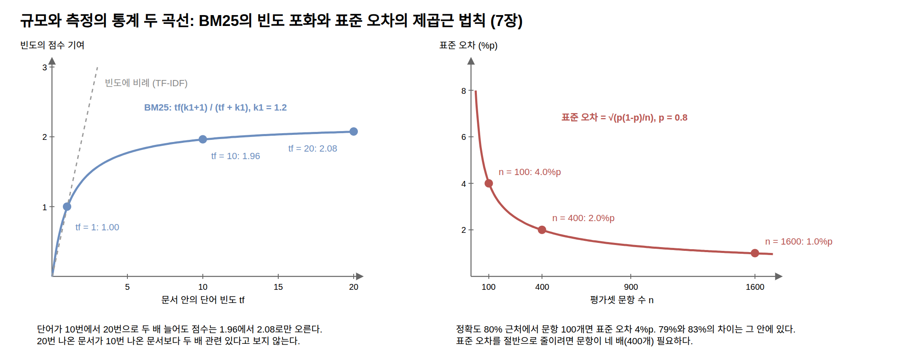

*t-검정*(t-test)은 이 판단을 절차로 만든 것이다. 두 평균의 차이를 표준 오차로 나눈 값(t 통계량)을 구해서, 그 차이가 우연으로 설명되기 어려운 정도인지(통계적으로 유의한지)를 계산한다. 표본이 충분히 크면 t의 절댓값이 약 2를 넘을 때 "우연히 이만한 차이가 날 확률이 5% 아래"라고 판정한다. 위의 예에 적용하면 이렇다.

----
각 정확도의 표준 오차: sqrt(0.79 * 0.21 / 100) ≈ 0.041,  sqrt(0.83 * 0.17 / 100) ≈ 0.038
차이의 표준 오차:      sqrt(0.041² + 0.038²) ≈ 0.055
t = (0.83 - 0.79) / 0.055 ≈ 0.7
----

두 정확도가 서로 다른 문항 집합에서 나왔다면 t가 약 0.7로 2에 한참 못 미친다. RAG 평가처럼 같은 질문 집합에 두 구성을 실행한 경우라면, 질문별 점수 차이를 먼저 구하고 그 평균이 0에서 벗어났는지 보는 대응표본(paired) t-검정이 훨씬 민감하다. 질문 자체의 난이도가 만드는 흔들림이 두 구성에 똑같이 들어 있어 상쇄되기 때문이다.

.독립표본과 대응표본. 79%와 83%의 분포는 대부분 겹치지만, 같은 질문에 두 구성을 실행하면 질문별 차이가 일정해서 같은 개선이 유의하게 잡힌다
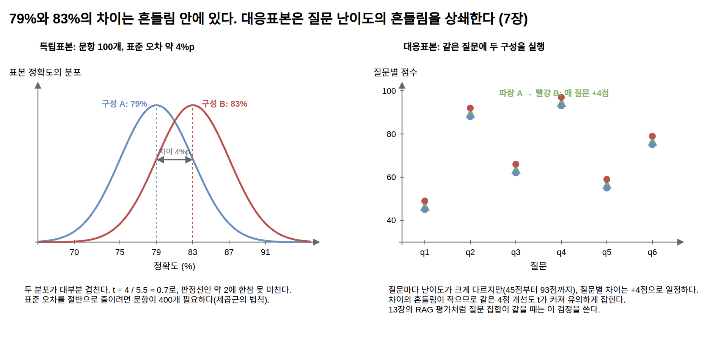

*분산 분석*(ANOVA)은 비교 대상이 셋 이상일 때의 도구다. 임베딩 모델 세 개를 비교하면서 t-검정을 쌍마다 반복하면 우연히 유의해 보이는 결과가 나올 확률이 누적된다(다중 비교 문제). 분산 분석은 집단 사이의 분산과 집단 안의 분산의 비율(F비)로 "차이가 하나라도 있는가"를 한 번에 검정하고, 있다면 어느 쌍의 차이인지를 보정된 사후 검정으로 좁힌다. 이름은 분산 분석이지만 실제로 비교하는 것은 평균들이고, 분산은 그 판단의 잣대로 쓰인다.

이 도구들이 13장의 평가 논의에 더하는 결론은 한 줄이다. 평가셋이 작을수록 지표의 %p 차이보다 표본 크기를 먼저 봐야 하고, 벤치마크 리더보드의 미세한 순위 차이를 읽을 때도 같은 잣대가 적용된다.

== 더 공부하려면

이 장에 나온 값들을 직접 계산해 보고 싶다면 ``examples/math-lab``에 검산 실습 코드를 두었다. 이 장의 절 순서를 그대로 따라가면서, 본문에 적힌 값을 Apache Commons Math로 다시 구해 맞는지 확인한다. 숫자를 맞춰 보는 데 그치지 않고 "상관계수는 평균을 뺀 두 배열의 코사인 유사도와 같다", "교차 엔트로피는 엔트로피와 KL 발산의 합이다", "정규 분포의 분위수에 격자를 두면 균등 격자보다 양자화 오차가 작다" 같은 이 장의 서술을 코드로 확인한다. temperature나 표본 크기 같은 값을 바꿔 가며 결과가 어떻게 달라지는지 보는 것이 이 코드의 쓰임새다.

개념들이 하나의 프로그램 안에서 어떻게 이어지는지 보고 싶다면 4장과 5장의 microGPT 예제(``examples/java/microgpt``)가 가장 좋은 놀이터다. 손실, softmax, 기울기가 모두 스칼라 단위의 코드로 드러나 있다. 더 깊은 수학을 원한다면 부록 더 읽을거리에서 소개하는 Karpathy의 Neural Networks: Zero to Hero 강의와 3Blue1Brown의 시각화 시리즈가 이 장 앞부분과 같은 순서의 개념을 영상으로 다룬다. 벨만 방정식과 강화학습을 제대로 파려면 더 읽을거리의 Sutton과 Barto 교과서가 표준이고, 스케일링 법칙의 원 논문들도 더 읽을거리에 정리해 두었다.

여기까지가 2부다. 다음 토큰 예측이라는 문제 정의에서 출발해 학습과 추론을 코드로 확인했고, 그 추론이 프로덕션 규모에서 갖는 비용 구조를 측정했으며, 이 장에서 그 코드 뒤의 수학을 정리했다. 이제 이렇게 학습되고 서빙되는 모델이 파일로 저장되어 세계에 유통되는 방식, 그리고 그 유통을 떠받치는 표준들을 3부에서 살펴본다.
