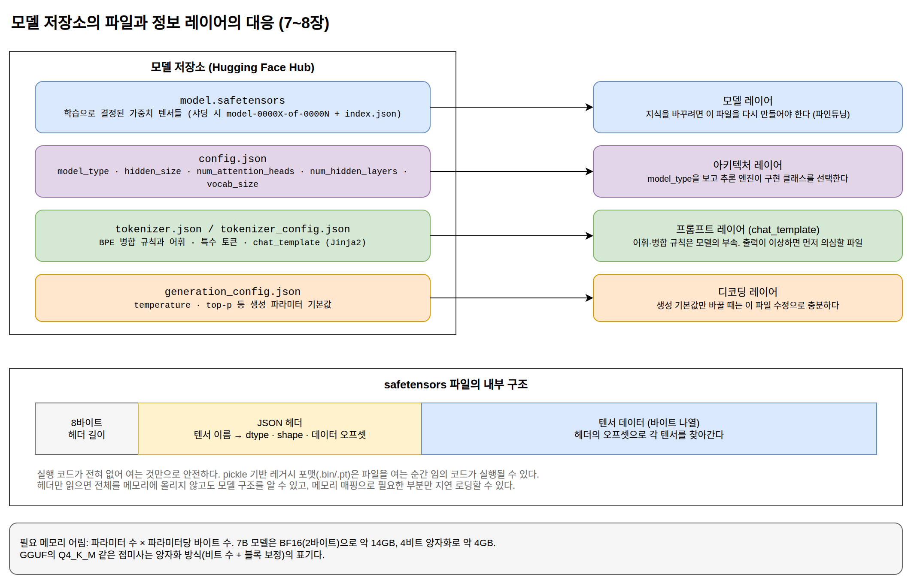

[[ch-architecture-conventions]]
= 아키텍처 규약과 추론 엔진

== transformers: 규약의 진원지

가중치 파일만으로는 모델을 실행할 수 없다. 그 숫자들을 어떤 구조에 배치할지, 즉 블록이 몇 개이고 헤드가 몇 개이며 어텐션이 어떤 변형인지 알아야 한다. 이 정보를 담는 규약을 정착시킨 것이 Hugging Face의 `transformers` 라이브러리다.

``transformers``는 "머신러닝계의 GitHub"라고 불릴 만큼 중심적인 플랫폼이 되었다. 수십만 개의 모델이 이 라이브러리의 파일 규약에 맞춰 허브에 올라오고, 사용자는 모델이 무엇이든 같은 인터페이스로 로딩한다. 이 규약이 세 가지 사실상 표준(de facto standard) 중 두 번째다.

== config.json: 모델의 설계도

모델 저장소의 중심에는 ``config.json``이 있다.

[source,json]
----
{
  "model_type": "llama",
  "hidden_size": 4096,
  "num_attention_heads": 32,
  "num_hidden_layers": 32,
  "vocab_size": 32000
}
----

핵심은 `model_type` 필드다. 이 값이 "llama"면 라이브러리는 `LlamaForCausalLM` 클래스로 모델을 조립해야 한다는 것을 안다. 로딩 코드는 이 필드를 보고 해당 아키텍처의 구현 클래스를 자동으로 선택하고, 나머지 필드로 크기를 정한 뒤, safetensors의 텐서들을 이름으로 대응시켜 채워 넣는다.

나머지 필드는 2부 microGPT에서 우리가 상수로 정했던 값들과 정확히 대응한다. ``hidden_size``는 microGPT의 임베딩 차원(16), ``num_attention_heads``는 헤드 수(2), ``num_hidden_layers``는 블록 수(1), ``vocab_size``는 어휘 크기(27)의 프로덕션 버전이다. microGPT를 이해했다면 ``config.json``은 낯선 파일이 아니라 이미 아는 상수들의 목록이다.

== 함께 유통되는 설정 파일들

모델 저장소에는 `config.json` 외에 두 종류의 설정 파일이 더 있다.

`tokenizer.json` / `tokenizer_config.json`::
텍스트를 토큰으로 나누는 규칙과 사전. BPE 병합 규칙, 특수 토큰 정의, 채팅 템플릿이 들어 있다. 어휘 크기는 모델에 따라 3만에서 25만 개 수준이다. microGPT의 27자 문자 사전과 역할이 같고, 규모와 알고리즘만 다르다. 이 파일들의 내용은 다음 장에서 자세히 다룬다.

`generation_config.json`::
temperature, top-p 같은 생성 파라미터의 기본값. 사용자가 별도로 지정하지 않을 때 적용된다.

== 추론 엔진 간 호환성

같은 모델 파일(safetensors + config.json)을 서로 다른 추론 엔진들이 실행할 수 있다.

* *transformers*: 표준 파이썬 라이브러리. 연구와 프로토타이핑의 기준.
* *vLLM*: 고성능 서빙 엔진. PagedAttention 같은 기법으로 동시 요청 처리량을 높인다.
* *TGI(Text Generation Inference)*: Hugging Face의 자체 서빙 엔진.
* *Ollama / llama.cpp*: GGUF로 변환해서 CPU와 엣지 환경에서 실행. 개인 장비에서 오픈 모델을 돌리는 가장 흔한 경로다.
* *ONNX Runtime*: ONNX 포맷으로 변환해서 다양한 언어와 런타임에서 실행. 4부의 Spring AI 예제가 임베딩 모델을 자바에서 로컬 실행할 수 있는 것이 이 방식 덕분이다.

이 호환성이 가능한 이유는 표준 문서가 있어서가 아니라, 공개되는 모델 대부분이 소수의 아키텍처(Llama, Mistral, Qwen, Gemma 계열)를 채택하기 때문이다. 각 엔진은 이 소수의 아키텍처를 미리 구현해 두고, ``config.json``의 ``model_type``을 보고 해당 구현을 선택한다. 이것이 세 번째 표준인 "소수 아키텍처로의 수렴"이다.

수렴에는 반대급부도 있다. 완전히 새로운 아키텍처의 모델이 나오면 각 엔진이 지원을 추가할 때까지 그 모델은 transformers에서만 돈다. 새 아키텍처를 시도하는 쪽이 생태계 전체의 지원을 받기까지 시차가 생기므로, 수렴은 안정성을 주는 동시에 구조적 실험의 속도를 늦춘다.

== 파일과 정보 레이어의 대응

1부의 레이어 분류를 모델 저장소의 실제 파일에 대응시키면 다음과 같다.

[cols="1,1,2"]
|===
| 파일 | 대응 레이어 | 담는 내용

| `model.safetensors`
| 모델 레이어
| 학습으로 결정된 가중치

| `config.json`
| 아키텍처 레이어
| 블록 수, 헤드 수 등 구조 정의

| `tokenizer.json`
| 프롬프트 레이어
| 텍스트를 토큰으로 나누는 규칙

| `generation_config.json`
| 디코딩 레이어
| 출력 제어 기본값
|===

.모델 저장소의 파일과 정보 레이어의 대응

이 대응은 실무 판단의 기준이 된다. 모델의 지식을 바꾸려면 ``model.safetensors``를 다시 만들어야 하고(파인튜닝), 생성 기본값만 바꾸려면 `generation_config.json` 수정으로 충분하다. 파인튜닝된 모델을 받았는데 출력이 이상하다면 가중치보다 먼저 토크나이저와 채팅 템플릿 설정을 의심하는 식의 진단도 가능해진다. 문제가 어느 파일에 있는지 좁히는 것은 곧 어느 레이어에 있는지 좁히는 것이다.

== 정리

Hugging Face 생태계의 호환성은 다음 세 가지의 조합이다.

1. *Safetensors*: 단순하고 안전한 바이너리 포맷. 7장에서 Go로 직접 만들어 본 것처럼 어느 언어에서든 다룰 수 있다.
2. *transformers의 config 규약*: ``model_type``으로 아키텍처를 자동 식별한다.
3. *소수 아키텍처로의 수렴*: 추론 엔진들이 미리 구현해 둘 수 있을 만큼 아키텍처 종류가 적다.

셋 다 표준 기구의 스펙이 아니라 생태계가 수렴한 결과다. 이 규약들 가운데 응용 개발자의 일상과 가장 가까운 것이 토크나이저와 채팅 템플릿이다. 다음 장에서 자세히 살펴본다.
