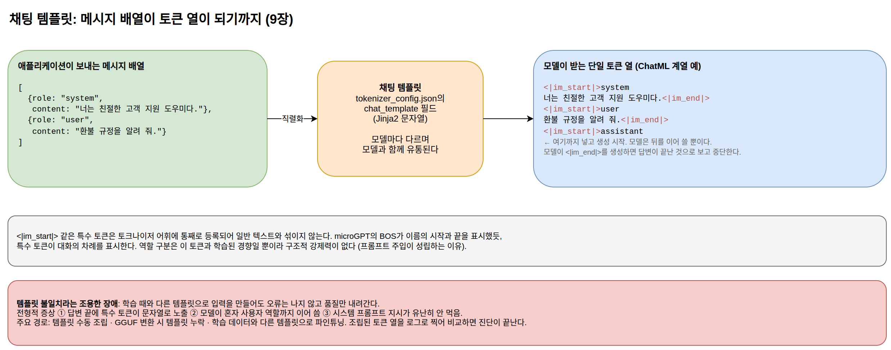

[[ch-tokenizer-chat-template]]
= 토크나이저와 채팅 템플릿

== 응용 개발자와 가장 가까운 파일

앞 장에서 모델 저장소의 파일들을 살펴보았다. 그중 ``model.safetensors``와 ``config.json``은 추론 엔진이 소비하는 파일이라 응용 개발자가 직접 열어 볼 일이 드물다. 토크나이저 관련 파일은 다르다. 토큰 수는 곧 API 비용과 응답 지연이고, 채팅 템플릿은 애플리케이션이 보낸 메시지가 모델에 실제로 도달하는 형태를 결정한다. 오픈 모델을 직접 서빙할 때 가장 자주 만나는 장애도 이 파일들에서 나온다. 이 장에서 두 가지를 자세히 살펴본다.

== BPE: 병합 규칙의 학습

4장에서 본 microGPT의 토크나이저는 문자 단위였다. 어휘가 27개뿐이라 단순하지만, 모든 글자가 토큰 하나를 차지하므로 시퀀스가 길어진다. 반대편 극단인 단어 단위 토크나이저는 시퀀스는 짧지만 어휘가 무한히 늘어나고, 사전에 없는 신조어를 표현할 방법이 없다.

BPE(Byte Pair Encoding)는 두 극단 사이의 답이다. 문자 단위에서 출발하되, 코퍼스에서 자주 함께 나타나는 인접 토큰 쌍을 병합해서 새 토큰으로 등록하는 일을 원하는 어휘 크기가 될 때까지 반복한다. 자주 나오는 단어는 토큰 하나로 압축되고, 처음 보는 단어도 문자 조합으로 표현할 수 있다.

알고리즘이 얼마나 단순한지는 구현이 보여 준다. 이 절의 코드는 ``examples/go/bpe``에 있으며 표준 라이브러리만으로 동작한다.

[source,go]
----
include::../examples/go/bpe/main.go[tag=train,indent=0]
----

인코딩은 학습의 재생이다. 새 텍스트를 문자 단위로 쪼갠 뒤, 학습 때 기록한 병합 규칙을 같은 순서로 적용한다.

[source,go]
----
include::../examples/go/bpe/main.go[tag=encode,indent=0]
----

작은 한국어 코퍼스로 12번 병합을 학습시키면 다음과 같은 결과가 나온다. 공백은 SentencePiece 방식대로 `▁` 문자로 바꿔서 병합에 참여시켰다.

----
== 학습된 병합 규칙 (적용 순서대로) ==
 1: "다" + "▁" -> "다▁"
 2: "은" + "행" -> "은행"
 3: "학" + "교" -> "학교"
 ...
11: "서" + "▁만나자" -> "서▁만나자"
12: "에" + "서▁만나자" -> "에서▁만나자"

== 인코딩 ==
"은행에서 보자" -> ["은행" "에" "서" "▁" "보" "자"]
"은행나무" -> ["은행" "나" "무"]
----

이 출력에서 세 가지를 관찰할 수 있다.

첫째, "은행"과 "학교"가 사전이나 문법 지식 없이 통계만으로 토큰이 되었다. 코퍼스에 자주 등장했기 때문이다. 둘째, 병합은 형태소 경계를 존중하지 않는다. "에서▁만나자"처럼 조사와 동사가 붙은 덩어리도 자주 나오면 그대로 토큰이 된다. 4부에서 한국어 키워드 검색에 형태소 분석기가 따로 필요한 이유가 여기서도 보인다. LLM의 토크나이저는 언어학적 단위가 아니라 압축 효율의 단위로 텍스트를 자른다. 셋째, 코퍼스에 없던 "은행나무"는 "은행", "나", "무" 세 토큰으로 쪼개졌다. 프로덕션 모델에서 사내 용어나 제품명이 여러 토큰으로 분해되는 현상의 축소판이다.

프로덕션 토크나이저는 이 원리를 문자 대신 바이트 수준에 적용한다(byte-level BPE). 출발 어휘를 256개 바이트로 잡으면 어떤 유니코드 문자든, 심지어 깨진 인코딩까지 표현할 수 없는 입력이 없어진다. GPT 계열이 이 방식이고, Llama 계열이 쓰는 SentencePiece도 병합 대신 확률 모델을 쓰는 변형(Unigram)이 있을 뿐 "서브워드 어휘를 데이터에서 학습한다"는 틀은 같다. 학습된 병합 규칙과 어휘는 8장에서 본 ``tokenizer.json``에 담겨 모델과 함께 유통된다.

== 토큰 효율: 같은 뜻, 다른 비용

병합 규칙이 코퍼스 빈도를 따른다는 사실에는 실무적인 결과가 하나 따라온다. 토크나이저 학습 코퍼스에 많이 담긴 언어일수록 긴 병합이 만들어져 적은 토큰으로 표현되고, 적게 담긴 언어는 잘게 쪼개진다. 영어 중심 코퍼스로 학습된 토크나이저에서 같은 내용의 한국어 문장은 영어 문장보다 토큰 수가 많은 경우가 흔하다. 격차는 토크나이저마다 다르고, 최근 모델들이 다국어 데이터를 늘리고 어휘를 확대하면서 줄어드는 추세지만, 없어지지는 않았다.

토큰 수는 세 가지 비용으로 직결된다.

API 비용:: 상용 API는 입력과 출력을 토큰 단위로 과금한다. 같은 문서라도 토큰이 많이 나오는 언어면 그만큼 더 낸다.
응답 지연:: 생성은 토큰을 하나씩 순차로 만드는 과정이므로(2부에서 본 대로), 같은 내용의 답변도 토큰 수가 많으면 오래 걸린다.
컨텍스트 소진:: 컨텍스트 윈도우는 토큰 수 기준이다. 토큰 효율이 낮은 언어는 같은 창에 담을 수 있는 내용이 적다. RAG에서 컨텍스트에 넣을 수 있는 청크 수가 줄어든다는 뜻이기도 하다.

어휘 크기 자체도 교환 관계 위에 있다. 어휘를 키우면 시퀀스가 짧아지지만, 8장의 ``config.json``에서 본 것처럼 토큰 임베딩 행렬은 ``vocab_size × hidden_size``이므로 어휘에 비례해 파라미터가 늘어난다. 현재 모델들의 어휘가 3만에서 25만 개 사이에 모여 있는 것은 이 교환의 균형이 그 근처에 있기 때문이다.

실무 지침은 단순하다. 감으로 추정하지 말고 세어 본다. 각 모델의 토크나이저는 라이브러리(OpenAI의 tiktoken, Hugging Face의 tokenizers)로 로컬에서 실행할 수 있고, API 응답의 usage 필드는 실제 과금된 토큰 수를 알려 준다. 프롬프트 템플릿을 고칠 때 토큰 수를 함께 확인하는 습관이 비용과 지연 문제를 미리 잡아 준다.

== 채팅 템플릿: 대화가 모델에 도달하는 형태

애플리케이션은 LLM에 role과 content로 이루어진 메시지 배열을 보낸다. 그러나 2부에서 본 것처럼 모델이 받는 입력은 단일한 토큰 열 하나다. 메시지 배열을 토큰 열로 직렬화하는 규칙이 채팅 템플릿(chat template)이다. 예를 들어 ChatML 계열 템플릿은 대화를 이렇게 펼친다.

----
<|im_start|>system
너는 친절한 고객 지원 도우미다.<|im_end|>
<|im_start|>user
환불 규정을 알려 줘.<|im_end|>
<|im_start|>assistant
----

`<|im_start|>`, ``<|im_end|>``는 4장에서 BOS의 확장판이라고 예고했던 특수 토큰이다. 역할의 시작과 끝을 표시하며, 토크나이저 어휘에 통째로 등록되어 있어 일반 텍스트와 섞이지 않는다. 주목할 것은 마지막 줄이다. 어시스턴트 차례의 시작 토큰까지 넣은 상태에서 생성을 시작하면, 모델이 하는 일은 그 뒤를 이어 쓰는 것뿐이다. 모델이 ``<|im_end|>``를 생성하면 답변이 끝난 것으로 보고 생성을 중단한다. microGPT가 BOS로 이름의 시작과 끝을 배웠던 것과 같은 원리가 대화의 차례에 적용되고 있다.

이 구조는 1부 2장의 주장을 물증으로 보여 준다. 시스템 프롬프트와 사용자 메시지의 구분은 컨텍스트 안의 특수 토큰일 뿐이고, 그 토큰을 경계로 지시의 우선순위를 다르게 취급하는 것은 학습으로 만들어진 경향이다. 역할 구분에 구조적 강제력이 없다는 사실이 템플릿의 실제 모습에서 그대로 드러난다.

.채팅 템플릿: 메시지 배열이 단일 토큰 열이 되기까지

템플릿은 모델마다 다르다. Llama 계열, Gemma, Qwen이 각자 다른 특수 토큰과 배치 규칙을 쓴다. 그래서 ``transformers``는 템플릿 자체를 모델과 함께 유통하는 규약을 정착시켰다. ``tokenizer_config.json``의 `chat_template` 필드에 Jinja2 템플릿이 문자열로 들어 있고, 라이브러리와 서빙 엔진들은 이 템플릿을 읽어 메시지 배열을 자동으로 직렬화한다. 가중치 포맷, 아키텍처 규약과 마찬가지로 표준 기구 없이 정착한 규약이다.

== 템플릿 불일치라는 조용한 장애

채팅 템플릿이 장애 진단에서 중요한 이유는 실패 방식에 있다. 학습 때 쓰인 템플릿과 다른 형태로 입력을 만들어도 오류는 나지 않는다. 모델은 어떤 토큰 열이든 받아서 그럴듯한 다음 토큰을 생성하기 때문이다. 대신 품질이 조용히 내려간다. 전형적인 증상은 이렇다.

* 답변 끝에 `<|im_end|>` 같은 특수 토큰이 문자열로 노출된다. 생성 중단 조건이 템플릿과 어긋나 있다는 신호다.
* 모델이 답변을 마친 뒤 혼자 사용자 역할까지 이어 써서 가상의 대화를 계속한다.
* 시스템 프롬프트의 지시가 유난히 먹히지 않는다. 지시가 학습 때의 위치와 다른 자리에 들어가고 있을 가능성이 있다.

이 장애를 만나는 경로는 주로 세 가지다. 오픈 모델을 받아 직접 서빙하면서 템플릿을 수동으로 조립하는 경우, GGUF 변환 과정에서 템플릿 메타데이터가 누락되거나 구버전으로 들어간 경우, 파인튜닝을 학습 데이터와 다른 템플릿으로 한 경우다. 상용 API 뒤에서는 제공자가 템플릿을 관리해 주므로 이 문제를 볼 일이 없지만, 오픈 모델을 직접 다루는 순간부터는 첫 번째 점검 목록에 올려야 한다.

8장에서 "파인튜닝된 모델의 출력이 이상하면 가중치보다 먼저 토크나이저와 채팅 템플릿을 의심하라"고 했던 진단 원칙의 근거가 이것이다. 가중치가 잘못됐을 확률보다 직렬화가 어긋났을 확률이 훨씬 높고, 확인 비용도 적게 든다. 실제 입력으로 조립된 토큰 열을 로그로 찍어 학습 템플릿과 비교하는 것만으로 진단이 끝난다.

3부에서 확인한 표준들을 요약하면, 가중치는 safetensors로, 구조는 ``config.json``으로, 텍스트와 토큰 사이의 변환과 대화의 직렬화는 토크나이저 파일들로 유통되며, 이 전부가 소수 아키텍처 수렴 위에서 호환된다. 다음 부에서는 이렇게 유통되는 모델을 실제 서비스에 붙일 때 가장 자주 만드는 시스템인 RAG를 다룬다.
