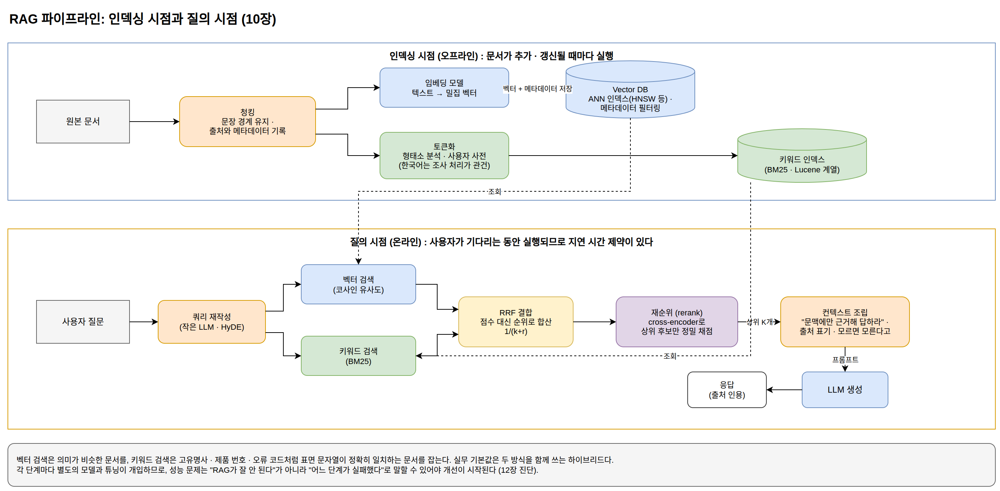

[[ch-rag-pipeline]]
= RAG 파이프라인과 검색의 원리

== RAG는 파이프라인이다

RAG(Retrieval-Augmented Generation)는 질문과 관련된 문서를 검색해서 LLM의 컨텍스트에 넣어 주는 시스템이다. 1부의 분류로는 컨텍스트 공급 레이어에 속한다. 2부에서 확인했듯 모델은 학습된 통계로 그럴듯한 토큰을 생성할 뿐이므로, 정확한 답의 근거는 밖에서 공급해야 한다. 그 공급 장치가 RAG다.

"RAG를 도입한다"는 말은 하나의 기능을 켜는 것이 아니라, 여러 단계로 이루어진 파이프라인을 구축한다는 뜻이다.

인덱싱 시점(오프라인)::
원본 문서 → 청킹 → 임베딩 → Vector DB 저장. 문서가 추가되거나 갱신될 때마다 실행된다. 출처, 작성일, 접근 권한 같은 메타데이터를 벡터와 함께 저장해 두어야 나중에 필터링과 인용이 가능하다.

질의 시점(온라인)::
사용자 질문 → 쿼리 재작성 → 임베딩 → 벡터 검색 + 키워드 검색 → 재순위(rerank) → 컨텍스트 조립 → LLM 프롬프트 전달 → 응답 생성. 사용자가 기다리는 동안 실행되므로 지연 시간 제약이 있다.

각 단계마다 별도의 모델이나 시스템이 개입하고, 서로 다른 튜닝이 필요하다. 성능 문제가 생겼을 때 "RAG가 잘 안 된다"가 아니라 "어느 단계가 실패했다"로 말할 수 있어야 개선이 시작된다. 그러려면 각 단계가 실제로 무슨 일을 하는지 알아야 한다.

.RAG 파이프라인: 인덱싱 시점과 질의 시점

이 장에서는 검색 파이프라인을 Go 표준 라이브러리만으로 바닥부터 구현한다(`examples/go/minirag`). 외부 서비스 없이 실행되므로 각 단계의 입출력을 눈으로 확인할 수 있다.

== 청킹: 검색의 단위 만들기

문서를 통째로 임베딩하면 여러 주제가 벡터 하나에 뭉개지고, 검색에 걸렸을 때 LLM 컨텍스트에도 통째로 넣어야 한다. 반대로 너무 잘게 자르면 조각만으로 의미가 통하지 않는다. 그래서 문서를 적절한 크기의 청크로 나누는 것이 파이프라인의 첫 단계다.

[source,go]
----
include::../examples/go/minirag/chunk.go[tag=chunking,indent=0]
----

고정 길이로 자르는 방식이 가장 단순하지만 문장 중간이 잘린다. 위 구현은 문장 경계를 먼저 찾고, 문장을 유지하면서 최대 길이 이하로 묶는다. 청크가 어느 문서의 몇 번째 조각인지도 함께 기록하는데, 이 출처 정보가 나중에 답변의 인용 근거가 된다.

== 키워드 검색: 토큰화와 BM25

검색의 첫 번째 방식은 키워드(lexical) 검색이다. 질의에 나온 단어가 실제로 등장하는 문서를 찾는다. 그 전에 "단어"를 어떻게 정의할지, 즉 토큰화 문제를 해결해야 한다.

[source,go]
----
include::../examples/go/minirag/bm25.go[tag=tokenize,indent=0]
----

한국어에서 공백 단위 토큰화가 실패하는 이유는 조사다. "은행이", "은행은", "은행에서"는 같은 단어지만 공백 기준으로는 전부 다른 토큰이다. 제대로 하려면 형태소 분석기가 필요하고(다음 장에서 다룬다), 이 예제는 형태소 분석기 없이 쓸 수 있는 차선책인 문자 바이그램을 쓴다. 검색 품질의 상한은 형태소 분석보다 낮지만, 조사 문제를 우회하는 원리는 보여 준다.

토큰화가 되면 BM25로 순위를 매긴다. BM25는 키워드 검색의 표준 알고리즘으로, Elasticsearch와 OpenSearch의 기반 검색 라이브러리인 Lucene이 기본 랭킹 함수로 쓴다. 원리는 세 요소의 조합이다. 질의 토큰이 희귀할수록(IDF), 그 토큰이 해당 청크에 자주 나올수록(TF) 점수가 높고, 청크가 평균보다 길면 점수를 깎아 긴 문서가 무조건 유리해지는 것을 보정한다.

[source,go]
----
include::../examples/go/minirag/bm25.go[tag=bm25,indent=0]
----

== 벡터 검색: 의미를 좌표로

두 번째 방식은 벡터 검색이다. 텍스트를 벡터(고차원 좌표)로 바꿔 두고, 질의 벡터와 가까운 청크를 찾는다. 표면 문자열이 아니라 벡터 공간의 거리로 유사성을 판단한다.

[source,go]
----
include::../examples/go/minirag/vector.go[tag=vector,indent=0]
----

이 예제의 벡터는 TF-IDF 기반이라 의미가 아니라 표면 문자열의 통계를 담는다. 실제 시스템은 학습된 임베딩 모델이 만든 밀집 벡터를 쓰고, 그래야 "노트북"과 "랩탑"처럼 표현이 다른 동의어가 가까운 벡터가 된다. 하지만 "벡터로 바꾼 뒤 기하학적 거리를 잰다"는 절차는 같으므로, 파이프라인 구조를 익히는 데는 이 구현으로 충분하다. 다음 장에서 실제 임베딩 모델로 교체한다.

=== Vector DB의 역할

여기서 Vector DB가 무엇인지 분명해진다. Vector DB는 고차원 벡터의 근사 최근접 이웃(ANN) 검색에 특화된 저장소이며, 핵심 책임은 세 가지다.

1. *벡터 인덱싱*: 위 예제처럼 모든 벡터를 순회(brute-force)하면 데이터가 커질수록 검색이 느려진다. HNSW, IVF, PQ 같은 ANN 인덱스는 정확도를 조금 양보하는 대신 sub-linear 시간에 검색한다. 이 인덱스들의 대표 오픈소스 구현이 Meta의 Faiss와 hnswlib이고, 여러 Vector DB가 내부에서 이 라이브러리들이나 같은 알고리즘의 자체 구현을 쓴다.
2. *유사도 계산*: 코사인 유사도, 내적, L2 거리 등을 임베딩 모델의 특성에 맞게 제공한다.
3. *메타데이터 필터링*: "2024년 이후 문서 중에서", "이 사용자가 권한을 가진 문서 중에서" 같은 조건을 벡터 검색과 결합한다.

흔한 오해도 짚어 두자. 첫째, Vector DB가 의미를 이해하는 것이 아니다. 의미를 벡터에 인코딩하는 것은 임베딩 모델이고, DB는 기하학적 거리만 계산한다. 검색 품질이 낮다면 먼저 의심할 대상은 DB가 아니라 임베딩 모델과 청킹이다. 둘째, 전용 Vector DB가 항상 필요한 것도 아니다. PostgreSQL의 pgvector 확장이나 Elasticsearch의 벡터 필드로 시작해도 충분한 경우가 많다. 이미 운영 중인 DB에 벡터 기능을 얹는 쪽이 새 인프라를 들이는 것보다 나은 출발일 수 있다.

== 하이브리드 검색: 두 방식의 결합

벡터 검색이 항상 키워드 검색보다 낫지는 않다. 고유명사, 제품 번호, 오류 코드 같은 질의는 표면 문자열이 정확히 일치하는 문서를 찾는 lexical 검색이 더 정확하다. 벡터 검색은 "의미가 비슷한" 문서를 찾을 뿐 "정확히 그 코드가 나오는" 문서를 보장하지 않기 때문이다. 그래서 실무의 기본값은 두 방식을 함께 쓰는 하이브리드 검색이다.

문제는 BM25 점수와 코사인 유사도의 단위가 달라 직접 더할 수 없다는 것이다. Reciprocal Rank Fusion(RRF)은 점수 대신 순위를 사용해서 이 문제를 피한다. 각 검색 결과에서 순위 r인 문서에 `1/(k+r)` 점을 주고 합산하면, 두 방식 모두에서 상위에 오른 문서가 최종 상위가 된다.

[source,go]
----
include::../examples/go/minirag/vector.go[tag=rrf,indent=0]
----

== 파이프라인 조립과 프롬프트

전체 흐름을 조립하면 다음과 같다.

[source,go]
----
include::../examples/go/minirag/main.go[tag=pipeline,indent=0]
----

마지막 단계는 검색 결과를 LLM 프롬프트로 조립하는 것이다. 1부의 용어로는 컨텍스트 공급 레이어가 가져온 정보를 프롬프트 레이어가 토큰으로 조립하는 단계다.

[source,go]
----
include::../examples/go/minirag/main.go[tag=prompt,indent=0]
----

"주어진 문맥에만 근거해서 답하라"는 지시, 출처 표기 요구, "없으면 모른다고 답하라"는 지시가 환각을 줄이는 기본 장치다. `go run .` 으로 실행하면 "카페 와이파이에서 사내 시스템에 접속해도 되나요?" 같은 구어체 질의에 보안지침 문서의 VPN 조항이 1위로 검색되고, 최종 프롬프트가 조립되어 출력되는 것을 확인할 수 있다.

여기까지가 검색 파이프라인의 전체 구조다. 다음 장에서는 장난감 구현을 실제 구성으로 바꾼다. TF-IDF 벡터를 진짜 임베딩 모델로 교체하고, 한국어 처리에서 품질을 좌우하는 구성요소들을 살펴본다.
