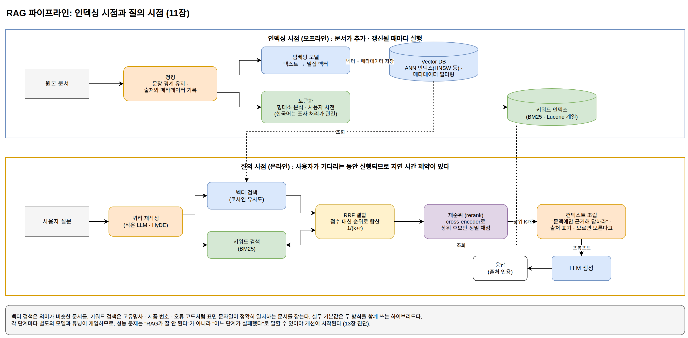
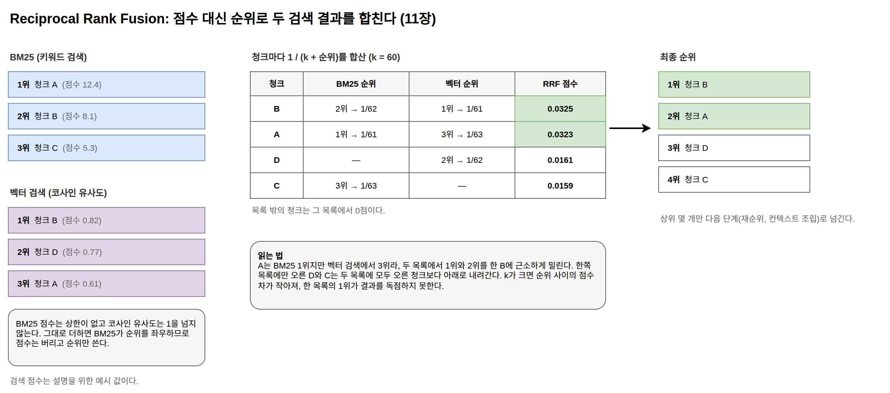

[[ch-rag-pipeline]]
= RAG 파이프라인과 검색의 원리

== RAG는 파이프라인이다

RAG(Retrieval-Augmented Generation)는 질문과 관련된 문서를 검색해서 LLM의 컨텍스트에 넣어 주는 시스템이다. 1부의 분류로는 컨텍스트 공급 레이어에 속한다. 2부에서 확인했듯 모델은 학습된 통계로 그럴듯한 토큰을 생성할 뿐이므로, 정확한 답의 근거는 밖에서 공급해야 한다. 그 공급 장치가 RAG다.

"RAG를 도입한다"는 말은 기능 하나를 켠다는 뜻이 아니라, 여러 단계로 이루어진 파이프라인을 만든다는 뜻이다.

인덱싱 시점(오프라인)::
원본 문서 → 청킹 → 임베딩 → Vector DB 저장. 문서가 추가되거나 갱신될 때마다 실행된다. 출처, 작성일, 접근 권한 같은 메타데이터를 벡터와 함께 저장해 두어야 나중에 검색 결과를 조건으로 걸러 내고 답변에 출처를 밝힐 수 있다.

질의 시점(온라인)::
사용자 질문 → 쿼리 재작성 → 임베딩 → 벡터 검색 + 키워드 검색 → 재순위(rerank) → 컨텍스트 조립 → LLM 프롬프트 전달 → 응답 생성. 사용자가 기다리는 동안 실행되므로 전체 과정을 짧은 시간 안에 끝내야 한다.

단계마다 별도의 모델이나 시스템이 관여하고, 튜닝하는 방법도 다르다. 성능 문제가 생겼을 때 "RAG가 잘 안 된다"가 아니라 "정답 문서가 검색 상위 20개 안에 없다"처럼 어느 단계가 실패했는지로 말할 수 있어야 무엇을 고칠지 정할 수 있다. 그러려면 각 단계가 실제로 무슨 일을 하는지 알아야 한다.

.RAG 파이프라인: 인덱싱 시점과 질의 시점

이 장에서는 검색 파이프라인을 자바 표준 라이브러리만으로 바닥부터 구현한다(`examples/java/minirag`). 외부 서비스 없이 실행되므로 각 단계의 입출력을 눈으로 확인할 수 있다.

== 청킹: 검색의 단위 만들기

문서를 통째로 임베딩하면 여러 주제가 벡터 하나에 섞여 어느 주제로 질의해도 뚜렷하게 가까워지기 어렵고, 검색에 걸렸을 때 LLM 컨텍스트에도 통째로 넣어야 한다. 반대로 너무 잘게 자르면 조각만으로 의미가 통하지 않는다. 예를 들어 "3년 이상 근속하면 2년마다 1일씩 가산되어 최대 25일까지 늘어난다"라는 문장만 떼어 내면 무엇이 늘어나는지(연차 휴가) 알 수 없다. 그래서 문서를 적절한 크기의 청크로 나누는 것이 파이프라인의 첫 단계다.

[source,java]
----
include::../examples/java/minirag/Chunk.java[tag=chunking,indent=0]
----

고정 길이로 자르는 방식이 가장 단순하지만 문장 중간이 잘린다. 위 구현은 마침표·물음표·느낌표 뒤의 공백과 줄바꿈을 문장 경계로 보고 텍스트를 문장으로 나눈다. 그다음 문장을 자르지 않은 채 최대 길이(문자 수 기준, 예제에서는 120자)를 넘기 직전까지 이어 붙여 청크를 만든다. 청크에는 어느 문서(`docId`)의 몇 번째 조각(`seq`)인지도 함께 기록한다. 이 출처 정보가 나중에 답변에서 근거 문서를 밝히는 데 쓰인다.

== 키워드 검색: 토큰화와 BM25

검색의 첫 번째 방식은 키워드(lexical) 검색이다. 질의에 나온 단어가 실제로 등장하는 문서를 찾는다. 그러려면 먼저 텍스트를 어떤 단위의 "단어"로 자를지, 즉 토큰화 방법을 정해야 한다.

[source,java]
----
include::../examples/java/minirag/Tokenizer.java[tag=tokenize,indent=0]
----

한국어에서는 조사 때문에 공백 단위 토큰화가 통하지 않는다. "은행이", "은행은", "은행에서"는 같은 단어지만 공백 기준으로는 전부 다른 토큰이다. 제대로 하려면 형태소 분석기가 필요하다(다음 장에서 다룬다). 이 예제는 형태소 분석기 없이 쓸 수 있는 차선책으로 문자 바이그램을 쓴다. 문자 바이그램은 단어를 연속한 두 글자씩 겹쳐 자르는 방식이다. "은행이"는 ["은행", "행이"]가 되고 "은행에서"는 ["은행", "행에", "에서"]가 되어, 조사가 달라도 "은행"이라는 토큰을 공유한다. 형태소 분석만큼의 검색 품질은 기대할 수 없지만, 조사 문제를 우회하는 원리는 이것으로 확인할 수 있다.

텍스트를 토큰으로 나누고 나면 BM25로 청크의 순위를 매긴다. BM25는 키워드 검색의 표준 알고리즘으로, Elasticsearch와 OpenSearch의 기반 검색 라이브러리인 Lucene이 기본 랭킹 함수로 쓴다. 점수는 세 요소로 정해진다. 첫째, 질의 토큰이 적은 수의 청크에만 나올수록(IDF) 점수가 높다. 여러 청크에 두루 나오는 토큰은 청크를 구별하는 데 도움이 덜 되기 때문이다. 둘째, 그 토큰이 해당 청크에 자주 나올수록(TF) 점수가 높다. 셋째, 청크가 평균보다 길면 점수를 깎는다. 긴 청크는 토큰이 많아 어떤 질의에든 걸리기 쉬우므로 그만큼 보정하는 것이다.

[source,java]
----
include::../examples/java/minirag/Bm25Index.java[tag=bm25,indent=0]
----

== 벡터 검색: 의미를 좌표로

두 번째 방식은 벡터 검색이다. 텍스트를 벡터(고차원 좌표)로 바꿔 두고, 질의 벡터와 가까운 청크를 찾는다. 표면 문자열이 아니라 벡터 공간의 거리로 유사성을 판단한다.

[source,java]
----
include::../examples/java/minirag/VectorIndex.java[tag=vector,indent=0]
----

이 예제의 벡터는 TF-IDF 벡터다. 청크에 나온 바이그램마다 등장 횟수에 IDF 가중치를 곱한 값을 좌표로 삼고, 벡터 길이를 1로 맞춘다. 그래서 의미가 아니라 표면 문자열의 통계를 담는다. 실제 시스템은 학습된 임베딩 모델이 만든 밀집 벡터를 쓰고, 그래야 "노트북"과 "랩탑"처럼 표현이 다른 동의어가 가까운 벡터가 된다. 하지만 "벡터로 바꾼 뒤 기하학적 거리를 잰다"는 절차는 같으므로, 파이프라인 구조를 익히는 데는 이 구현으로 충분하다. 다음 장에서 실제 임베딩 모델로 교체한다.

=== Vector DB의 역할

이 구현을 보면 Vector DB가 하는 일이 분명해진다. Vector DB는 고차원 벡터의 근사 최근접 이웃(ANN) 검색에 특화된 저장소다. ANN 검색은 질의 벡터와 가장 가까운 벡터를 전부 비교해서 정확히 찾는 대신, 근사적으로 빠르게 찾는 방식이다. Vector DB의 핵심 책임은 세 가지다.

1. *벡터 인덱싱*: 위 예제처럼 모든 벡터를 순회(brute-force)하면 데이터가 커질수록 검색이 느려진다. HNSW, IVF, PQ 같은 ANN 인덱스는 실제 최근접 이웃을 가끔 놓치는 대신, 데이터 개수에 비례하는 것보다 느리게 늘어나는 시간(sub-linear)에 검색한다. 이 인덱스들의 대표 오픈소스 구현이 Meta의 Faiss와 hnswlib이고, 여러 Vector DB가 내부에서 이 라이브러리들이나 같은 알고리즘의 자체 구현을 쓴다.
2. *유사도 계산*: 코사인 유사도, 내적, L2(유클리드) 거리 등을 제공해서 임베딩 모델이 학습된 방식에 맞는 척도를 고를 수 있게 한다.
3. *메타데이터 필터링*: "2024년 이후 문서 중에서", "이 사용자에게 권한이 있는 문서 중에서" 같은 조건을 벡터 검색과 결합한다.

흔한 오해도 두 가지 정리해 두자. 첫째, Vector DB가 의미를 이해하는 것이 아니다. 의미를 벡터에 인코딩하는 것은 임베딩 모델이고, DB는 기하학적 거리만 계산한다. 검색 품질이 낮다면 먼저 의심할 대상은 DB가 아니라 임베딩 모델과 청킹이다. DB 쪽에서 검색 품질에 영향을 주는 것은 위에서 말한 ANN 인덱스의 정확도 설정 하나다. 이 영향은 같은 질의를 전수 비교(brute-force)한 결과와 대조해서 따로 확인할 수 있다. 둘째, 전용 Vector DB가 항상 필요한 것도 아니다. PostgreSQL의 pgvector 확장이나 Elasticsearch의 벡터 필드로 시작해도 충분한 경우가 많다. 이미 운영 중인 DB에 벡터 기능을 얹는 쪽이 새 인프라를 들이는 것보다 나은 출발일 수 있다.

== 하이브리드 검색: 두 방식의 결합

벡터 검색이 항상 키워드 검색보다 낫지는 않다. 고유명사, 제품 번호, 오류 코드 같은 질의는 표면 문자열이 정확히 일치하는 문서를 찾는 lexical 검색이 더 정확하다. 벡터 검색은 "의미가 비슷한" 문서를 찾을 뿐 "정확히 그 코드가 나오는" 문서를 보장하지 않기 때문이다. 그래서 실무의 기본값은 두 방식을 함께 쓰는 하이브리드 검색이다. 다만 이 예제의 벡터 경로는 TF-IDF라서 두 경로가 모두 표면 문자열만 본다. 방금 말한 하이브리드의 이득은 벡터 경로에 학습된 임베딩 모델을 붙였을 때 나타나고, 이 예제로 확인하는 것은 단위가 다른 두 점수를 합치는 절차다.

문제는 BM25 점수와 코사인 유사도의 단위가 다르다는 점이다. BM25 점수는 정해진 상한이 없고 코사인 유사도는 1을 넘지 않으므로, 그대로 더하면 값의 범위가 큰 쪽이 순위를 좌우한다. Reciprocal Rank Fusion(RRF)은 점수 대신 순위를 사용해서 이 문제를 피한다. 각 검색 결과에서 순위 r인 문서에 `1/(k+r)` 점을 주고 합산하면, 두 방식 모두에서 상위에 오른 문서가 최종 상위가 된다. 예제처럼 k=60이면 한쪽 목록에서만 1위인 문서는 1/61≈0.0164점을 받고, 두 목록에서 모두 2위인 문서는 2/62≈0.0323점을 받아 더 높은 순위에 오른다.

.RRF로 두 검색 결과의 순위를 합치는 계산

[source,java]
----
include::../examples/java/minirag/Rrf.java[tag=rrf,indent=0]
----

== 파이프라인 조립과 프롬프트

전체 흐름을 조립하면 다음과 같다.

[source,java]
----
include::../examples/java/minirag/Main.java[tag=pipeline,indent=0]
----

마지막 단계는 검색 결과를 LLM 프롬프트로 조립하는 것이다. 1부의 용어로는 컨텍스트 공급 레이어가 가져온 정보를 프롬프트 레이어가 토큰으로 조립하는 단계다.

[source,java]
----
include::../examples/java/minirag/Main.java[tag=prompt,indent=0]
----

"주어진 문맥에만 근거해서 답하라"는 지시, 출처 표기 요구, "없으면 모른다고 답하라"는 지시가 환각을 줄이는 기본 장치다. ``java Main.java``로 실행하면 "카페 와이파이에서 사내 시스템에 접속해도 되나요?"라는 질의에 보안지침 문서의 VPN 조항이 1위로 검색된다. 이어서 그 결과로 조립한 최종 프롬프트가 출력된다. 이 예제에서 그 조항이 검색되는 것은 문서에 "공용 와이파이"와 "사내 시스템에 접속"이라는 표현이 그대로 들어 있기 때문이다. 질의의 "와이파이"와 문서의 "와이파이"가 "와이", "이파", "파이" 바이그램을 공유한다. 질의와 문서의 표현이 다를 때(예: "노트북"과 "랩탑") 찾아내려면 다음 장처럼 학습된 임베딩 모델을 붙여야 한다.

여기까지가 검색 파이프라인의 전체 구조다. 다음 장에서는 한국어 처리에서 품질을 좌우하는 구성요소들을 살펴보고, TF-IDF 벡터를 학습된 임베딩 모델로 교체한 Spring AI 구성으로 이 파이프라인을 옮긴다.
