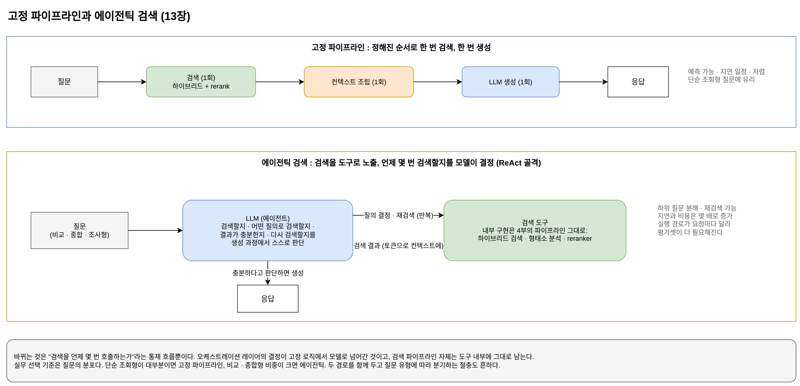

[[ch-rag-frontier]]
= RAG의 경계: 긴 컨텍스트와 에이전틱 검색

== 컨텍스트가 커지면 RAG는 필요 없어지는가

컨텍스트 윈도우가 수십만에서 수백만 토큰인 모델이 나오면서 자주 제기되는 질문이 있다. 문서 전부를 컨텍스트에 넣을 수 있다면 검색 파이프라인을 만들 이유가 있느냐는 것이다.

실제로 통째로 넣기가 나은 상황이 있다. 대상 문서의 총량이 컨텍스트에 들어갈 만큼 작고(계약서 한 건, 매뉴얼 한 권), 질문이 특정 조각이 아니라 문서 전반의 종합을 요구할 때다. 이럴 때 검색은 오히려 정보를 잘라 내는 손실 단계가 된다. 검색 없이 전체를 넣는 구성도 1부의 분류로는 똑같이 컨텍스트 공급 레이어이며, 부끄러운 지름길이 아니라 정당한 설계 선택지다.

그러나 코퍼스가 그보다 크면 검색은 여전히 필요하다. 이유는 네 가지다.

비용과 지연:: 2장에서 본 것처럼 컨텍스트는 요청마다 다시 과금된다. 수백만 토큰을 매 요청에 넣는 비용은 검색 파이프라인 운영 비용을 압도하고, 입력 처리 시간도 그에 비례해 늘어난다.
실효 활용의 한계:: 역시 2장에서 본 대로, 컨텍스트에 넣을 수 있다는 것과 모델이 활용한다는 것은 다르다. 관련 없는 내용이 많이 섞일수록 정답 근거를 놓칠 확률이 올라간다. 검색은 토큰을 아끼는 수단이면서 동시에 모델의 주의를 정답 근처로 모아 주는 수단이다.
권한과 필터링:: 사용자마다 볼 수 있는 문서가 다른 시스템에서는 컨텍스트를 조립하기 전에 권한으로 걸러야 한다. 전체 코퍼스를 넣는 구성은 접근 제어와 양립할 수 없다. 10장에서 메타데이터 필터링이 Vector DB의 핵심 책임에 들어 있던 이유다.
갱신과 출처:: 문서의 추가와 삭제를 반영하고, 답변이 어느 문서에 근거했는지 인용하려면 문서를 조각 단위로 다루는 인덱스가 필요하다.

정리하면 긴 컨텍스트는 RAG를 대체하는 것이 아니라 설계의 여유를 넓힌다. top-K를 몇 개에서 수십 개로 늘리고, 청크를 문단이 아니라 문서 단위로 잡고, 검색된 문서의 원문 전체를 넣는 선택이 가능해진다. 12장의 순위 실패(정답이 top-20에는 있는데 top-3에 못 드는 경우)도 컨텍스트 예산이 크면 그만큼 관대해진다.

== 프롬프트 캐싱과 컨텍스트 배치

긴 컨텍스트의 비용 문제를 완화하는 수단이 2장에서 소개한 프롬프트 캐싱이다. 캐싱의 실체는 6장에서 본 KV 캐시의 재사용이므로, 캐시가 적중하는 범위는 이전 요청과 토큰이 완전히 같은 접두사까지다. 이 성질이 RAG의 컨텍스트 배치에 구체적인 지침을 준다.

* 요청 사이에 변하지 않는 것(시스템 프롬프트, 도구 정의, 고정 참고 문서)을 컨텍스트 앞쪽에 배치한다.
* 요청마다 바뀌는 것(검색 결과, 사용자 질문)을 뒤쪽에 배치한다.

검색 결과는 질문마다 달라지므로 캐싱 이득을 보기 어렵다. 이것이 RAG의 비용 특성이다. 같은 문서 집합에 대해 질문이 반복되는 워크로드라면, 검색 없이 문서 전체를 고정 접두사로 넣고 캐싱하는 구성이 요청당 비용에서 역전하는 경우도 있다. 컨텍스트 설계는 품질만이 아니라 캐시 적중률의 문제이기도 하다.

== 에이전틱 검색: 파이프라인에서 도구로

지금까지 다룬 RAG는 고정 파이프라인이었다. 질문이 들어오면 정해진 순서대로 검색하고, 한 번 조립한 컨텍스트로 한 번 생성한다. 이 구조는 예측 가능하고 지연이 일정하지만, 두 종류의 질문에서 한계가 드러난다.

하나는 여러 번의 검색이 필요한 질문이다. "연차 이월 규정과 육아휴직 규정 중 내 상황에 유리한 쪽은?"이라는 질문은 서로 다른 문서를 각각 검색해서 비교해야 한다. 한 번의 검색으로는 어느 한쪽 문서만 걸리기 쉽다. 다른 하나는 첫 검색이 실패했을 때다. 고정 파이프라인은 검색 결과가 부실해도 그 사실을 판단하지 못하고 그대로 생성을 진행한다.

에이전틱 검색(agentic retrieval)은 검색을 파이프라인의 고정 단계가 아니라 2장에서 본 도구 사용의 도구로 모델에 노출한다. 모델이 검색할지 말지, 어떤 질의로 검색할지, 결과가 충분한지, 다시 검색할지를 생성 과정에서 스스로 결정한다. 2장의 ReAct 패턴이 그대로 골격이 된다. 질문을 하위 질문으로 분해해서 각각 검색하고, 결과를 보고 질의를 고쳐 다시 검색하는 동작이 자연스럽게 나온다.

이때 4부에서 만든 파이프라인이 버려지는 것이 아니라는 점이 중요하다. 하이브리드 검색, 형태소 분석, reranker는 도구 내부의 구현으로 그대로 남는다. 바뀌는 것은 "검색을 언제 몇 번 호출하는가"라는 통제 흐름뿐이고, 1부의 분류로 말하면 오케스트레이션 레이어의 결정이 고정 로직에서 모델로 넘어간 것이다.

대가도 분명하다. LLM 호출과 검색이 여러 번 반복되므로 지연과 비용이 몇 배로 늘고, 실행 경로가 요청마다 달라지므로 평가와 디버깅이 어려워진다. 12장의 평가셋은 에이전틱 구성에서 덜 필요해지는 것이 아니라 더 필요해진다. 실무의 선택 기준은 질문의 분포다. 단순 조회형 질문이 대부분이면 고정 파이프라인이 빠르고 저렴하며, 비교·종합·조사형 질문의 비중이 크면 에이전틱 구성이 품질 차이를 만든다. 두 경로를 함께 두고 질문 유형에 따라 분기하는 절충도 흔하다.

.고정 파이프라인과 에이전틱 검색

== 그 밖의 변형들

같은 문제의식에서 나온 변형이 몇 가지 더 있다. 각각 어떤 질문 유형의 실패를 겨냥하는지와 함께 보면 위치가 잡힌다.

GraphRAG:: 인덱싱 때 LLM으로 문서에서 엔티티와 관계를 추출해 그래프를 만들고, 그래프의 군집별 요약을 미리 생성해 둔다. "이 문서 집합을 관통하는 주제는 무엇인가"처럼 특정 청크가 아니라 코퍼스 전반에 대한 질문은 청크 검색으로 답할 수 없는데, 이 유형을 겨냥한 설계다. Microsoft가 같은 이름의 오픈소스 구현을 공개해 이 접근이 널리 알려졌다. 인덱싱 비용이 LLM 호출로 인해 상당히 커진다는 것이 대가다.
계층 요약 인덱스:: 청크들을 묶어 요약하고 요약을 다시 요약해서 트리를 만든 뒤, 질문의 추상 수준에 맞는 층에서 검색한다(RAPTOR가 대표적이다). 세부 사실 질문과 종합 질문을 한 인덱스로 감당하려는 시도다.
구조화 데이터 라우팅:: 질문에 따라 비정형 문서 검색이 아니라 SQL 생성이나 API 호출로 분기한다. "지난 분기 매출"은 문서가 아니라 데이터베이스에 있다. 컨텍스트 공급 레이어의 공급원이 텍스트 코퍼스만은 아니라는 당연한 사실의 구현이다.

새 변형은 계속 나올 것이다. 평가 방법은 변하지 않는다. 12장의 진단 순서대로, 어떤 질문 유형이 어느 단계에서 실패하는지 측정하고, 그 실패를 겨냥한 변형만 도입한다. 유행하는 구성을 실패 데이터 없이 들여오는 것은 개선 우선순위를 거꾸로 밟는 또 하나의 방식이다.

== 레이어 지도로 돌아가며

이 장에서 다룬 기법들은 이름이 새롭지만, 이 책의 지도 위에서는 전부 아는 자리에 놓인다. 긴 컨텍스트 활용과 프롬프트 캐싱은 프롬프트 레이어의 비용 구조 문제이고, 에이전틱 검색은 컨텍스트 공급 레이어와 오케스트레이션 레이어의 결합이며, GraphRAG와 계층 요약은 인덱싱 전략의 변형이다.

이것이 이 책이 전하려던 방법이다. 1부에서 정보가 모델에 들어가는 경로의 지도를 그렸고, 2부에서 그 지도의 바탕인 다음 토큰 예측을 실행되는 코드로 확인했고, 3부에서 학습된 모델이 유통되는 규약을 확인했고, 4부에서 가장 흔한 응용인 RAG를 구성요소와 진단 순서로 분해했다. 새로운 이름의 기법을 만나면 3장의 질문으로 돌아가면 된다. 파라미터를 바꾸는가, 컨텍스트를 공급하는가, 토큰 조립 방식인가, 중간 상태나 출력 분포에 대한 개입인가. 이 질문에 답할 수 있으면 그 기법의 비용, 지속성, 적용 범위를 유행과 무관하게 추론할 수 있다. 기법의 이름은 계속 바뀌지만, 학습된 파라미터로 다음 토큰을 예측하는 기계라는 바탕은 그대로이기 때문이다.
